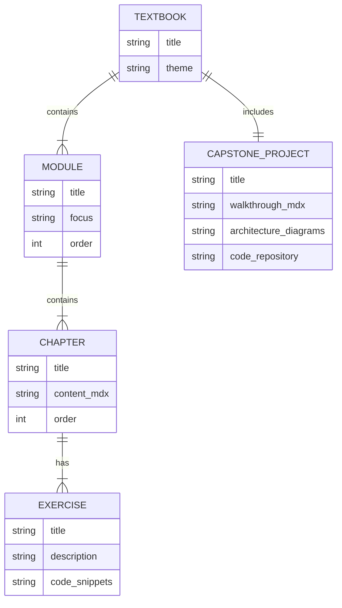

# Data Model: Textbook Content Structure

This document defines the structure and attributes of the key content entities for the "Physical AI & Humanoid Robotics" textbook.

## Entity Relationship Diagram

## Entity Definitions

### Textbook
The top-level container for the entire book.

- **`title`** (string, required): The main title of the textbook.
- **`theme`** (string): The central theme or tagline.
- **`modules`** (list of `Module`): An ordered list of the content modules.
- **`capstone_project`** (`Capstone_Project`): The final, integrated project.

### Module
A major section of the textbook, equivalent to a Part or Unit.

- **`title`** (string, required): The name of the module (e.g., "The Robotic Nervous System (ROS 2)").
- **`focus`** (string, required): A brief description of the module's learning objectives.
- **`order`** (int, required): The sequential order in which the module appears.
- **`chapters`** (list of `Chapter`): An ordered list of chapters within the module.

### Chapter
A single article of content. This maps directly to a `.md` or `.mdx` file.

- **`title`** (string, required): The title of the chapter.
- **`order`** (int, required): The sequential order of the chapter within its module.
- **`content_mdx`** (string, required): The full Markdown/MDX content of the chapter, including text, diagrams, and code snippets.
- **`frontmatter`** (object, required): Docusaurus frontmatter (e.g., `id`, `title`, `sidebar_label`).
- **`exercises`** (list of `Exercise`): Associated practical exercises.

### Exercise
A hands-on lab or set of practice questions associated with a chapter or module.

- **`title`** (string, required): The name of the exercise.
- **`description`** (string, required): The instructions and goals for the exercise.
- **`code_snippets`** (list of string): The associated starter or solution code.

### Capstone Project
The final, mandatory project that integrates all skills from the modules.

- **`title`** (string, required): The project title.
- **`walkthrough_mdx`** (string, required): A detailed, step-by-step guide to completing the project.
- **`architecture_diagrams`** (list of string): Mermaid or image-based diagrams of the project's architecture.
- **`code_repository`** (string): A reference to the location of the full source code for the project (e.g., a sub-directory in the `/examples` folder).
- **`evaluation_rubric`** (string): The criteria for assessing the completed project.
