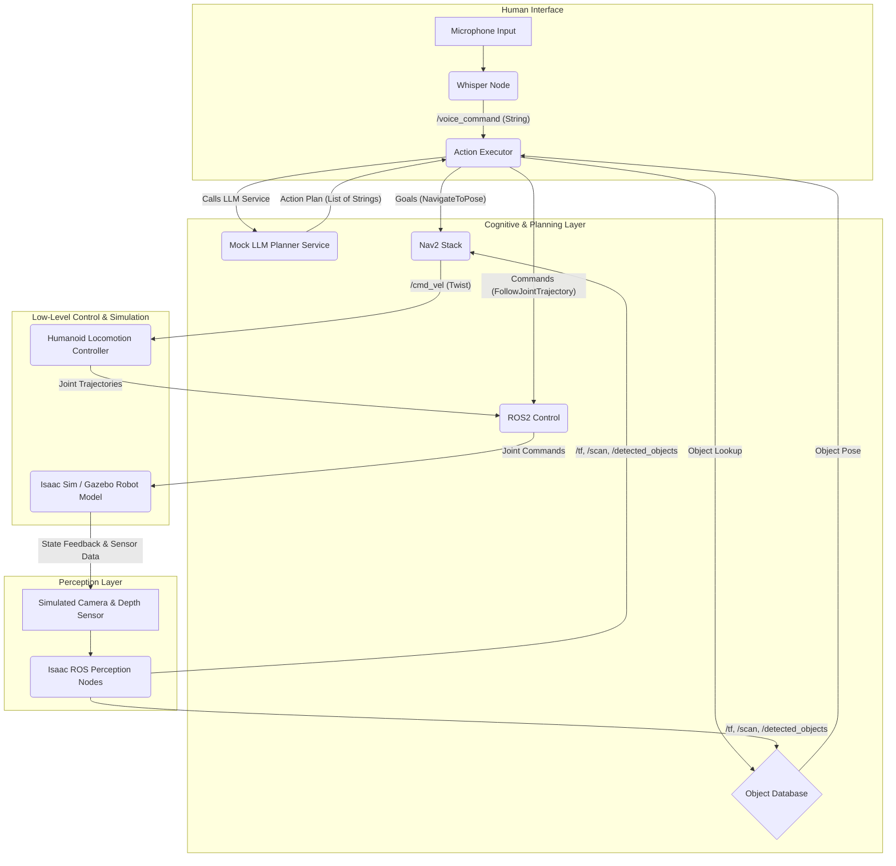

# 1. Capstone Project: The Autonomous Humanoid Assistant

Congratulations on making it to the Capstone Project! This is where you'll bring together all the knowledge and skills you've gained throughout the textbook to build a fully autonomous humanoid assistant in a simulated environment.

Your goal is to create a robot that can:
-   **Understand voice commands** for high-level tasks.
-   **Perceive its environment** to locate objects and navigate.
-   **Plan and execute a sequence of actions** to fulfill the commands.
-   **Navigate autonomously** to target locations.
-   **Simulate basic manipulation** of objects.

## Project Overview

You will be tasked with integrating the ROS 2 fundamentals from Module 1, the simulation capabilities of Module 2, the AI perception and planning tools of Module 3, and the Vision-Language-Action pipelines of Module 4.

The project will culminate in a simulated humanoid robot that can respond to a voice command like "Go to the table, pick up the blue ball, and bring it to me."

## System Architecture

The following diagram illustrates the complete system architecture for your autonomous humanoid assistant. You will be implementing and integrating each of these components.



### Component Breakdown:

1.  **Whisper Node**: Transcribes spoken commands into text and publishes them to the `/voice_command` topic.
2.  **Mock LLM Planner Service**: Translates the text command into a sequence of abstract actions (e.g., `navigate_to(location)`, `pick_up(object)`).
3.  **Object Database**: Stores the real-time 3D poses of detected objects, populated by the perception nodes.
4.  **Isaac ROS Perception Nodes**: Process simulated sensor data (stereo images, depth images, IMU) to provide visual SLAM (localization and mapping), 2D laser scans, and 3D object detection.
5.  **Nav2 Stack**: Takes navigation goals and produces velocity commands, avoiding obstacles using the perception data.
6.  **Humanoid Locomotion Controller**: Translates Nav2's velocity commands into specific joint trajectories for the humanoid's bipedal movement.
7.  **ROS 2 Control**: Manages the low-level joint control of the humanoid robot in the simulation.
8.  **Action Executor**: The central orchestrator. It subscribes to voice commands, calls the LLM, queries the object database, and executes the planned actions by interacting with Nav2 and ROS 2 Control.
9.  **Isaac Sim / Gazebo Robot Model**: The simulated humanoid robot, environment, and sensors.

## High-Level Setup Guide

### 1. Environment Setup
Ensure you have:
-   Ubuntu 22.04 LTS.
-   ROS 2 Humble Hawksbill installed and sourced.
-   A working `colcon` workspace (`~/ros2_ws`).
-   Your `py_pubsub`, `llm_planner_pkg`, `action_executor_pkg` packages in `~/ros2_ws/src/` and built.
-   Isaac Sim installed with Isaac ROS configured (if using Isaac Sim for simulation).

### 2. Robot Description (URDF/SDF)
-   Use your humanoid robot's URDF/SDF model, ensuring it has all necessary `<visual>`, `<collision>`, and `<inertial>` tags.
-   Ensure it includes Gazebo/Isaac Sim plugins for `ros2_control` and sensors (camera, depth sensor, IMU).

### 3. Simulation Launch File
Create a main launch file (`capstone_launch.py`) in a new package (e.g., `humanoid_capstone_pkg`) that starts:
-   Your chosen simulator (Isaac Sim or Gazebo) with your humanoid robot loaded.
-   `robot_state_publisher`
-   All necessary `ros2_control` controllers (joint state broadcaster, joint trajectory controller).
-   Your Isaac ROS perception nodes (VSLAM, depth image processing).
-   The full Nav2 stack, configured with the correct topics from your perception nodes.
-   Your `whisper_node`.
-   Your `mock_llm_planner`.
-   Your `action_executor`.
-   RViz for visualization.

### 4. Running the Project
1.  Open a terminal, navigate to your workspace, and source it:
    ```bash
    cd ~/ros2_ws
    source install/setup.bash
    ```
2.  Launch your capstone project:
    ```bash
    ros2 launch humanoid_capstone_pkg capstone_launch.py
    ```
3.  Open RViz and configure it to visualize the map, robot model, point clouds, and path plans.

### 5. Interacting with the Robot
-   Speak commands into your microphone.
-   Observe the robot's behavior in the simulation and its internal state in RViz.

## Evaluation Rubric

Your Capstone Project will be evaluated based on the following criteria:

| Criterion                     | Exceeds Expectations (100%)                                       | Meets Expectations (75%)                                       | Needs Improvement (50%)                                     |
| :---------------------------- | :---------------------------------------------------------------- | :------------------------------------------------------------- | :---------------------------------------------------------- |
| **System Integration**        | All components (Whisper, LLM, Perception, Nav2, Control) work seamlessly together. | Most components are integrated, minor issues remain.         | Significant integration gaps, core functionality broken.    |
| **Functionality**             | Robot reliably executes complex multi-step voice commands (e.g., navigate, perceive, "manipulate"). | Robot executes basic voice commands, some multi-step tasks fail. | Robot responds to few commands or fails often.              |
| **Code Quality & Clarity**    | Clean, well-commented, modular code. Clear ROS 2 package structure. | Code is functional but may lack comments or optimal structure. | Code is difficult to understand or poorly organized.         |
| **Documentation & Explanation** | Detailed README for the capstone package. Clear explanation of design choices. | Basic README and explanation.                                  | Missing or unclear documentation.                           |
| **Demonstration**             | Fluent demonstration of robot performing tasks in simulation.     | Demonstrates basic tasks, some errors encountered.           | Struggles to demonstrate basic functionality.               |

This Capstone Project is your opportunity to synthesize everything you've learned. Good luck, and have fun building your autonomous humanoid!
