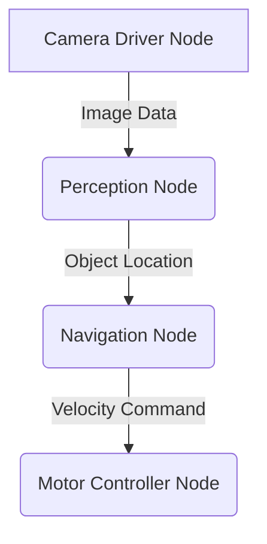

# 1. Introduction to the Robotic Nervous System (ROS 2)

Welcome to the first module of our journey into Physical AI. Before our humanoid robot can learn to see, think, or act, it needs a nervous system. In the world of modern robotics, that nervous system is the **Robot Operating System (ROS)**.

## What is ROS?

Contrary to its name, ROS is not actually an operating system in the traditional sense (like Windows or Linux). Instead, it's a **middleware**. Think of it as a flexible framework and a set of tools for building robot applications. It provides services you would expect from an OS, but for a robot, including:

- **Hardware Abstraction**: ROS allows you to write code without worrying about the specific hardware it will run on. A command to "move forward" works whether your robot has wheels, legs, or tracks.
- **Low-level Device Control**: It provides a way to interface with sensors and actuators.
- **Message Passing**: It enables communication between different parts of your robot's software. A camera sensor can "publish" an image, and a perception algorithm can "subscribe" to that image.
- **Package Management**: ROS has a rich ecosystem of community-contributed software packages that you can use, from navigation algorithms to a robot arm's control interface.

The version we are using in this textbook is **ROS 2**, specifically the **Humble Hawksbill** distribution. ROS 2 is a ground-up redesign of the original ROS, built to address the needs of modern robotics, including multi-robot systems, real-time control, and production environments.

## The Philosophy of ROS: A Graph of Nodes

The core architectural concept of ROS is the **ROS graph**. Imagine your robot's software is broken down into many small, independent programs called **nodes**. Each node has a single purpose.

For example, you might have:
- A `camera_driver` node that gets data from a camera.
- A `perception` node that processes the image to find objects.
- A `navigation` node that decides where to move.
- A `motor_controller` node that sends commands to the wheels.

These nodes are all running at the same time, and they communicate with each other by passing messages. This creates a graph-like structure.

This modular, message-passing architecture is incredibly powerful:
- **Fault Tolerance**: If one node crashes, the rest of the system can keep running.
- **Reusability**: You can easily swap out one node for another. Don't like our `navigation` node? Just write a new one that subscribes to and publishes the same message types.
- **Language Independence**: You can write nodes in Python, C++, or other languages, and they can all communicate seamlessly.
- **Distributed System**: Nodes can run on different computers, allowing you to build complex, multi-robot or cloud-connected systems.

## Why ROS is Essential for this Textbook

Throughout this book, ROS 2 will be the glue that holds everything together. We will use it to:
- Read data from simulated sensors like LiDAR and depth cameras.
- Send commands to the joints of our humanoid robot.
- Connect our AI/ML models to the robot's control systems.
- Manage the complex flow of information required for an autonomous system.

In the next chapter, we will dive deeper into the core concepts of the ROS graph: Nodes, Topics, Services, and Actions. Let's start building our robot's nervous system.
