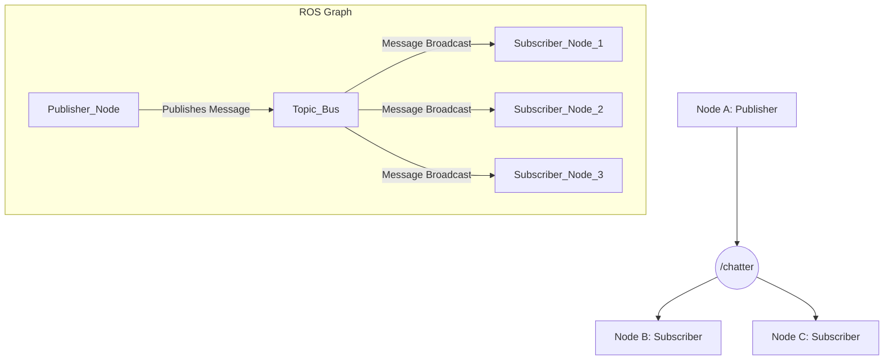
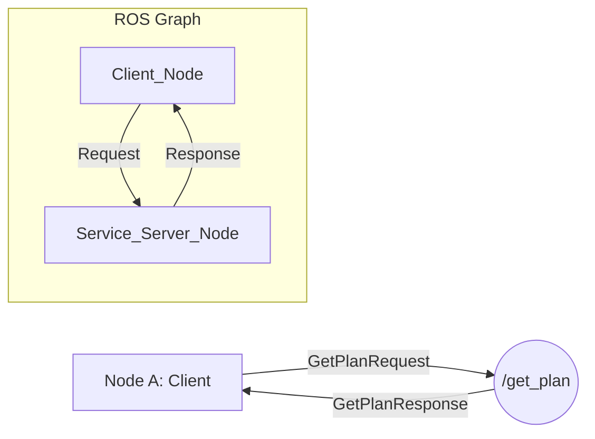
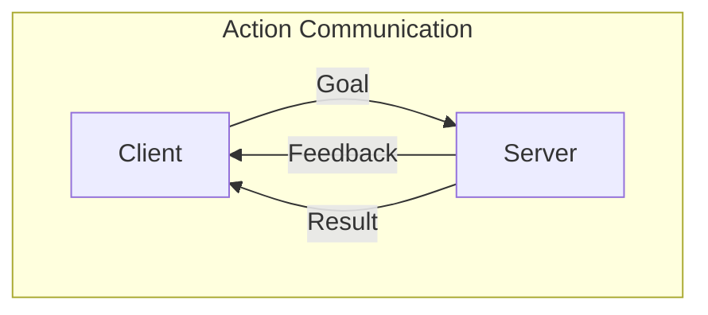

# 2. The Building Blocks: Nodes, Topics, Services, and Actions

In the last chapter, we introduced the ROS graph as a network of independent programs. Now, let's break down the four fundamental concepts that make this graph work: Nodes, Topics, Services, and Actions.

## 1. Nodes: The Processors

A **Node** is the smallest unit of computation in ROS. Think of it as a single-purpose executable program. In our humanoid robot, we might have nodes for:
- Reading sensor data (`lidar_driver`, `camera_driver`)
- Controlling motors (`arm_controller`, `base_controller`)
- Planning (`path_planner`, `grasp_planner`)
- Processing data (`perception`, `localization`)

Each node is responsible for a tiny piece of the robot's overall functionality. You can write nodes in Python (`rclpy`) or C++ (`rclcpp`). We will be using Python for this textbook.

To run a node, you use the `ros2 run` command:
```bash
# Syntax: ros2 run <package_name> <executable_name>
ros2 run my_robot_package talker_node
```

## 2. Topics: The Broadcast System

**Topics** are the primary way nodes communicate. They are named buses over which nodes can send and receive data. Topics use a **publish/subscribe** model.

- **Publisher**: A node that sends messages to a topic. For example, a `camera_driver` node publishes image data to an `/image_raw` topic.
- **Subscriber**: A node that receives messages from a topic. A `perception` node might subscribe to the `/image_raw` topic to get images for processing.

Any number of publishers can send data to a topic, and any number of subscribers can listen. This creates a one-to-many or many-to-many broadcasting system. It's decoupled—the publisher doesn't know or care who is listening.



The data sent over a topic is called a **message**. Each topic has a specific **message type** (e.g., `String`, `Int32`, `PoseStamped`).

**Key Command-Line Tools for Topics:**
- `ros2 topic list`: See all active topics.
- `ros2 topic echo /topic_name`: Print the data being published on a topic.
- `ros2 topic pub /topic_name <message_type> '<data>'`: Publish a single message from the command line.

## 3. Services: The Request/Response System

While topics are great for continuous data streams, sometimes you need a direct request/response interaction. This is what **Services** are for.

A service has two parts: a **request** and a **response**. One node acts as a **service server**, offering a specific service. Another node acts as a **service client**, calling that service and waiting for a response.

Unlike topics, services are a one-to-one communication mechanism. The client sends one request and gets back one response.



**When to use a Service:**
Use a service when you need to trigger a remote computation that will finish quickly, like:
- Querying the status of a device.
- Requesting a calculation (e.g., "calculate the inverse kinematics for this arm pose").
- Spawning a model in a simulation.

**Key Command-Line Tools for Services:**
- `ros2 service list`: See all active services.
- `ros2 service type /service_name`: Show the service type.
- `ros2 service call /service_name <service_type> '<request>'`: Call a service from the command line.

## 4. Actions: The Long-Running Task System

What if you need to command a task that takes a long time to complete, like navigating to a goal? A service isn't a good fit, because you don't want the client to be stuck waiting for seconds or even minutes.

This is where **Actions** come in. Actions are designed for long-running, asynchronous tasks that provide feedback while they are executing.

An action has three parts:
1.  **Goal**: The client sends a goal to the action server (e.g., "navigate to coordinates X, Y").
2.  **Feedback**: The server provides regular updates on its progress (e.g., "current distance to goal is 5 meters").
3.  **Result**: When the task is finished, the server sends a final result (e.g., "goal reached successfully").

This allows a client to send a goal, monitor its progress, and even cancel it if needed, all without blocking.



**When to use an Action:**
- Commanding a robot to move to a specific location.
- Executing a multi-step manipulation task (e.g., picking up an object).
- Performing a long-running calculation like building a map.

## Summary: Topics vs. Services vs. Actions

| Type | Communication Pattern | Use Case | Example |
|---|---|---|---|
| **Topic** | Publish/Subscribe (many-to-many) | Continuous data streams | Publishing camera images or laser scans. |
| **Service** | Request/Response (one-to-one) | Quick, remote procedure calls | Querying a setting or triggering a fast, blocking task. |
| **Action** | Asynchronous Goal/Feedback/Result | Long-running, non-blocking tasks | Commanding a robot to navigate to a goal 10 meters away. |

With these four concepts, you can build nearly any robotic application. In the next chapter, we'll write our first ROS 2 Python node and see them in action.
