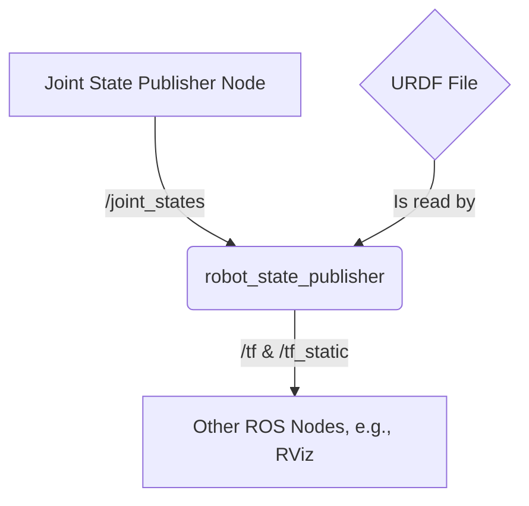

# 4. Describing Your Robot: The Unified Robot Description Format (URDF)

So far, we've created abstract nodes that pass data around. But how do we tell ROS what our robot actually *looks* like? How do we define its shape, its joints, and how all its parts connect?

The answer is the **Unified Robot Description Format (URDF)**. URDF is an XML-based file format used in ROS to describe all the physical elements of a robot.

A URDF file defines:
- The size and shape of each part of the robot.
- The visual appearance of each part (color, texture).
- The physical properties of each part (mass, inertia).
- The relationship between the parts (how they are connected and how they move).

Two ROS tools, **RViz** and **Gazebo**, can parse a URDF file to create a 3D visualization or simulation of your robot.

## The Core Components of URDF: Links and Joints

A URDF model is a tree of **links** connected by **joints**.

### Links
A **link** represents a rigid part of the robot. It has physical properties and a shape.
- **`<visual>`**: Defines what the link looks like (shape, color). This is used by visualization tools like RViz.
- **`<collision>`**: Defines the collision geometry of the link. This is used by physics engines like Gazebo to simulate contact. It's often a simpler shape than the visual one for performance.
- **`<inertial>`**: Defines the dynamic properties of the link, such as its mass and inertia tensor.

### Joints
A **joint** connects two links and defines how they can move relative to each other.
- **`parent`** and **`child`**: A joint connects one parent link to one child link, forming the tree structure.
- **`type`**: The type of motion the joint allows. Common types include:
    - **`revolute`**: A hinge joint that rotates around a single axis (like an elbow).
    - **`continuous`**: A revolute joint with no angle limits (like a wheel).
    - **`prismatic`**: A sliding joint that moves along an axis (like a piston).
    - **`fixed`**: A rigid connection between two links with no movement.

## Example: A Simple Two-Link Humanoid Arm

Let's look at a simple URDF for a robot arm with a shoulder and an elbow.

```xml
<?xml version="1.0"?>
<robot name="simple_humanoid_arm">

  <!-- Base Link (e.g., the robot's torso) -->
  <link name="base_link">
    <visual>
      <geometry>
        <box size="0.1 0.1 0.5" />
      </geometry>
      <origin xyz="0 0 0.25" rpy="0 0 0" />
      <material name="grey">
        <color rgba="0.5 0.5 0.5 1.0" />
      </material>
    </visual>
  </link>

  <!-- Shoulder Joint -->
  <joint name="shoulder_joint" type="revolute">
    <parent link="base_link" />
    <child link="upper_arm_link" />
    <origin xyz="0 0 0.5" rpy="0 0 0" />
    <axis xyz="0 1 0" />
    <limit lower="-1.57" upper="1.57" effort="10.0" velocity="1.0" />
  </joint>

  <!-- Upper Arm Link -->
  <link name="upper_arm_link">
    <visual>
      <geometry>
        <cylinder length="0.4" radius="0.04" />
      </geometry>
      <origin xyz="0 0 -0.2" rpy="0 0 0" />
      <material name="blue">
        <color rgba="0.0 0.0 1.0 1.0" />
      </material>
    </visual>
  </link>

  <!-- Elbow Joint -->
  <joint name="elbow_joint" type="revolute">
    <parent link="upper_arm_link" />
    <child link="forearm_link" />
    <origin xyz="0 0 -0.4" rpy="0 0 0" />
    <axis xyz="0 1 0" />
    <limit lower="-1.57" upper="1.57" effort="10.0" velocity="1.0" />
  </joint>

  <!-- Forearm Link -->
  <link name="forearm_link">
    <visual>
      <geometry>
        <cylinder length="0.3" radius="0.03" />
      </geometry>
      <origin xyz="0 0 -0.15" rpy="0 0 0" />
      <material name="grey" />
    </visual>
  </link>

</robot>
```

### Breakdown of the Example

1.  **`base_link`**: This is our root link, a simple grey box representing the torso.
2.  **`shoulder_joint`**: This is a `revolute` joint that connects the `base_link` (parent) to the `upper_arm_link` (child). It rotates around the Y-axis (`<axis xyz="0 1 0" />`).
3.  **`upper_arm_link`**: A blue cylinder representing the bicep.
4.  **`elbow_joint`**: Another `revolute` joint connecting the `upper_arm_link` to the `forearm_link`.
5.  **`forearm_link`**: A smaller grey cylinder for the forearm.

## The Robot State Publisher and TF2

Writing a URDF file is just the first step. To make it useful, you need a ROS node to parse it and publish the state of the robot.

This is the job of the **`robot_state_publisher`** node. This node reads the URDF, subscribes to the `/joint_states` topic (which contains the current angle of all the joints), and then publishes the 3D poses of all the robot's links.

It publishes this information using ROS's transformation library, **TF2**. TF2 keeps track of the coordinate frames of every part of the robot. For example, it knows where the `forearm_link` is relative to the `base_link` at any given moment.



By using the `robot_state_publisher` and TF2, any other node in your system can ask, "Where is the robot's hand right now?" without having to do any of the math itself.

In the next chapter, we'll connect our `rclpy` nodes to this system to actually control the joints we've defined here.
