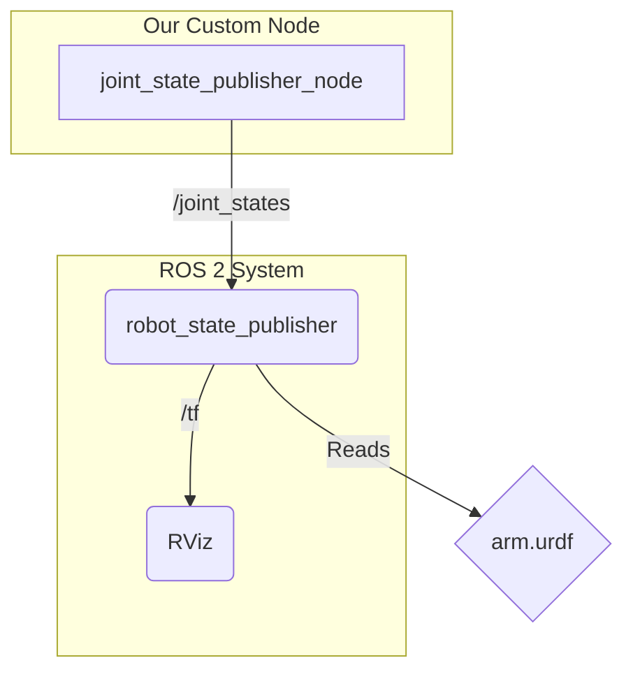

# 5. Connecting AI Agents to Robot Controllers

We've defined what our robot looks like with URDF, and we know how to write Python nodes with `rclpy`. Now, how do we command the robot to move?

The `robot_state_publisher` gets joint positions from the `/joint_states` topic. This means that if we can publish messages to `/joint_states`, we can control our robot's posture in RViz!

This is the fundamental connection point between a high-level AI agent and the low-level control of a robot. An "AI Agent" (which could be a simple script, a reinforcement learning policy, or an LLM-based planner) makes a decision, and that decision is translated into a target joint angle that gets published to the robot's controllers.

## A Simple "AI Agent": The Joint State Publisher Node

For now, our "AI Agent" will be a very simple Python node that publishes a sine wave motion to our arm joints. This will simulate a high-level agent sending dynamic commands to the robot.

This node will publish `sensor_msgs/msg/JointState` messages. This message type contains three arrays:
- `name`: A list of joint names (e.g., `['shoulder_joint', 'elbow_joint']`).
- `position`: A list of the corresponding joint angles in radians.
- `velocity`: (Optional) A list of joint velocities.

Let's create a new node in our `py_pubsub` package.

Create the file: `~/ros2_ws/src/py_pubsub/py_pubsub/joint_publisher_node.py`

```python
# ~/ros2_ws/src/py_pubsub/py_pubsub/joint_publisher_node.py

import rclpy
from rclpy.node import Node
from sensor_msgs.msg import JointState
from std_msgs.msg import Header
import math

class JointStatePublisher(Node):

    def __init__(self):
        super().__init__('joint_state_publisher')
        self.publisher_ = self.create_publisher(JointState, 'joint_states', 10)
        timer_period = 0.1  # seconds (10 Hz)
        self.timer = self.create_timer(timer_period, self.timer_callback)
        self.get_logger().info('Joint State Publisher has been started.')
        self.start_time = self.get_clock().now().seconds_nanoseconds()[0]

    def timer_callback(self):
        # Calculate the elapsed time
        current_time = self.get_clock().now().seconds_nanoseconds()[0]
        elapsed_time = float(current_time - self.start_time)

        # Create a JointState message
        joint_state_msg = JointState()
        joint_state_msg.header = Header()
        joint_state_msg.header.stamp = self.get_clock().now().to_msg()
        
        # Define the joint names from our URDF
        joint_state_msg.name = ['shoulder_joint', 'elbow_joint']
        
        # Calculate new joint positions using a sine wave for smooth motion
        # This simulates an "AI" decision loop
        shoulder_angle = math.sin(elapsed_time * 0.5) # Slower oscillation for shoulder
        elbow_angle = math.sin(elapsed_time * 1.0) # Faster oscillation for elbow
        
        joint_state_msg.position = [shoulder_angle, elbow_angle]
        
        # Publish the message
        self.publisher_.publish(joint_state_msg)
        # self.get_logger().info(f'Publishing joint states: {joint_state_msg.position}')

def main(args=None):
    rclpy.init(args=args)
    joint_state_publisher = JointStatePublisher()
    rclpy.spin(joint_state_publisher)
    joint_state_publisher.destroy_node()
    rclpy.shutdown()

if __name__ == '__main__':
    main()
```

### Code Breakdown

1.  **`JointStatePublisher`**: A new node that publishes `sensor_msgs/msg/JointState` messages.
2.  **`create_publisher`**: We create a publisher that sends `JointState` messages to the `/joint_states` topic. This is the exact topic that the `robot_state_publisher` listens to.
3.  **`timer_callback`**: This function runs 10 times per second (10 Hz).
4.  **Time Calculation**: We use the node's clock to get the elapsed time, which drives our sine wave function.
5.  **`JointState` Message**: We construct the message, making sure the `name` array matches the joint names in our URDF file *exactly*.
6.  **Sine Wave**: We use `math.sin()` to generate smooth, oscillating values for our joint angles. This is a common technique for creating simple, continuous motions and serves as a stand-in for a more complex AI agent's output.
7.  **Publish**: We publish the complete message.

## The Full Picture: From Agent to Visualization

Now let's put all the pieces from this module together. To see our robot arm move, we need to run three things:

1.  **The `robot_state_publisher`**: This node reads our URDF and listens for joint states.
2.  **Our `joint_state_publisher_node`**: Our new "AI agent" that publishes the target joint states.
3.  **RViz**: The 3D visualization tool that subscribes to the TF2 data published by the `robot_state_publisher`.

Here is the data flow:



When you run all these components (after building your package and sourcing the workspace), you will see the simple arm from the previous chapter waving in RViz!

This simple loop—an "agent" publishing joint commands which are then visualized—is the core of robot control. In later modules, we will replace our simple sine-wave publisher with much more intelligent nodes that can see the world, make decisions, and command the robot to perform complex tasks.
