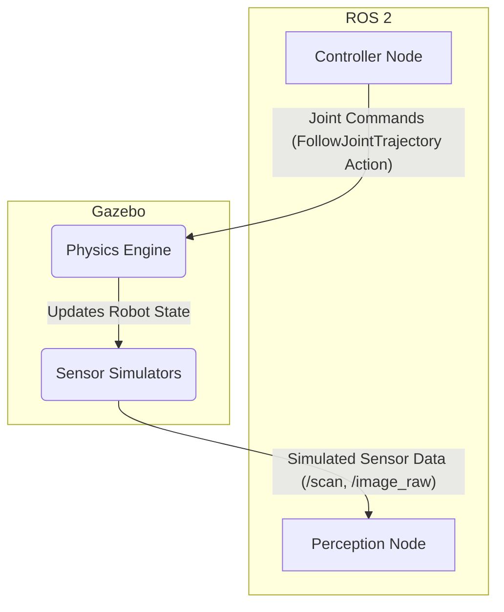

# 2. Simulating Physics with Gazebo

In the last chapter, we defined a Digital Twin as a physics-based simulation of our robot. Now, let's get our hands dirty with the tool that provides that physics: **Gazebo**.

Gazebo is a mature, open-source robotics simulator that is deeply integrated with the ROS ecosystem. While RViz *visualizes* the state of your robot, Gazebo *simulates* it. It understands mass, friction, gravity, and collisions. If you tell your robot to drive through a wall in Gazebo, it will stop (or break!).

## From URDF to SDF

While Gazebo can understand our URDF file from Module 1, it has its own native format called the **Simulation Description Format (SDF)**. SDF is an extension of URDF that includes many more tags specific to simulation, such as:
- `<world>`: To define the entire simulation environment, including lighting, gravity, and static objects like walls and tables.
- `<sensor>`: To model different kinds of sensors (cameras, LiDAR, IMUs).
- `<plugin>`: To add custom functionality via C++ plugins.

For simple cases, you can use your URDF directly in Gazebo. For more complex simulations, you will often convert your URDF to SDF and add the extra simulation-specific tags.

The key addition our URDF needs to work with Gazebo's physics engine is the `<collision>` and `<inertial>` tags for each link. RViz only cared about the `<visual>` tag, but Gazebo needs to know the physical substance of the robot.

Let's enhance one of our links from the URDF in Module 1:

```xml
<!-- Upper Arm Link -->
<link name="upper_arm_link">
  <inertial>
    <mass value="1.0" />
    <inertia ixx="0.01" ixy="0.0" ixz="0.0"
             iyy="0.01" iyz="0.0"
             izz="0.01" />
  </inertial>
  <collision>
    <geometry>
      <cylinder length="0.4" radius="0.04" />
    </geometry>
  </collision>
  <visual>
    <geometry>
      <cylinder length="0.4" radius="0.04" />
    </geometry>
    <material name="blue">
      <color rgba="0.0 0.0 1.0 1.0" />
    </material>
  </visual>
</link>
```
Here, we've added:
- **`<collision>`**: A simple cylinder that defines the "hard" shape of the link for the physics engine.
- **`<inertial>`**: The mass and inertia tensor of the link. These values are critical for a realistic simulation of how the robot will move and react to forces.

## The Gazebo ROS Bridge (`gazebo_ros_pkgs`)

How does Gazebo communicate with ROS 2? The magic happens through a set of plugins and nodes collectively known as `gazebo_ros_pkgs`. This "bridge" allows ROS 2 nodes to seamlessly interact with the Gazebo simulation.

Here's how it works:

1.  **Spawning the Robot**: You use a ROS 2 node (`spawn_entity.py`) to call a Gazebo service (`/spawn_entity`) to load your URDF/SDF file into the running simulation.

2.  **Hardware Interfaces**: You add special Gazebo plugins to your robot's description file. These plugins expose simulated hardware as standard ROS 2 interfaces. For example, the `libgazebo_ros2_control.so` plugin can read the `<joint>` tags in your URDF and create a `FollowJointTrajectory` action server for them.

3.  **Sensor Publishing**: You can add sensor plugins (like `libgazebo_ros_camera.so` or `libgazebo_ros_ray_sensor.so`) that will publish simulated sensor data to ROS 2 topics (`/image_raw`, `/scan`), which your perception nodes can subscribe to just as if it were real hardware.

This creates a powerful feedback loop:

A controller node (which could be driven by your AI agent) sends a joint command. The Gazebo physics engine simulates the effect of this command. The simulated sensors render the new state of the world and publish it back to ROS 2, where your perception nodes can process it. This is the heart of a Digital Twin.

## Launching a Gazebo Simulation

To put this all together, you typically use a ROS 2 **launch file**. A launch file is a Python script that automates the process of starting up all the necessary nodes and configurations for a complex application.

A launch file for a Gazebo simulation would typically:
1.  Start the Gazebo simulator with a specific world file.
2.  Find your robot's URDF file.
3.  Start the `robot_state_publisher` node.
4.  Start the node that spawns your robot into Gazebo.
5.  Start any controller nodes needed to move the robot.

We will build these launch files step-by-step in the exercises. In the next chapter, we'll look at how to use high-fidelity renderers like Unity for tasks where visual realism is more important than physical accuracy.
