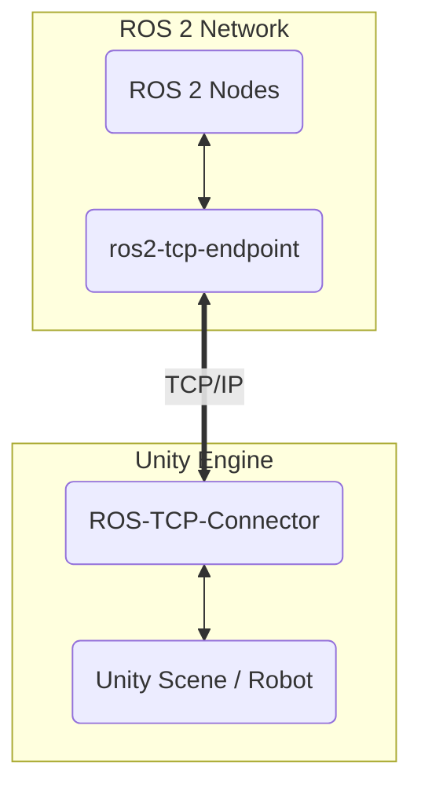

# 3. High-Fidelity Rendering with Unity for HRI

Gazebo is a fantastic tool for simulating physics, but its graphics are relatively simple. For many cutting-edge robotics applications, visual realism is not just a "nice-to-have"—it's a necessity. This is where game engines like **Unity** come in.

Unity is a professional, cross-platform game engine renowned for its stunning graphics, intuitive editor, and rich asset ecosystem. In recent years, it has become a major platform for robotics simulation, especially for tasks involving perception and human-robot interaction (HRI).

## Why Use a Game Engine for Robotics?

While Gazebo prioritizes physical accuracy, Unity prioritizes **visual accuracy**. This makes it the ideal choice for:

1.  **Training and Testing Perception Models**: If you are training a neural network to recognize objects from a camera feed, the training data needs to be as realistic as possible. Unity can generate massive, automatically-labeled datasets of photorealistic images under a wide variety of lighting conditions, camera angles, and object textures. This is known as **synthetic data generation**.

2.  **Human-Robot Interaction (HRI) Studies**: If you want to study how people react to and interact with a robot, the simulation needs to be believable. A photorealistic robot in a realistic environment elicits much more natural human responses than a blocky model in a simple world.

3.  **Reinforcement Learning (RL) in Complex Environments**: Training an RL agent to navigate a visually complex space (like a cluttered apartment or a dynamic warehouse) is much more effective in a realistic rendering of that space.

## The Trade-Off: Physics vs. Graphics

It's important to understand the fundamental difference in philosophy between Gazebo and Unity.

| Feature | **Gazebo** | **Unity** |
|---|---|---|
| **Primary Strength** | Accurate physics simulation | Photorealistic rendering |
| **Physics Engine** | Multiple high-precision options (e.g., ODE, DART) | Optimized for game performance (e.g., NVIDIA PhysX) |
| **Use Case** | Testing controllers, balance, grasping, dynamics | Training vision models, HRI, synthetic data generation |
| **ROS Integration** | Native, deep integration (`gazebo_ros_pkgs`) | Via a plugin (Unity Robotics Hub) |

In many advanced robotics workflows, engineers use **both**: they test their low-level controllers and dynamics in a physics-focused simulator like Gazebo, and they test their high-level perception and planning systems in a graphics-focused simulator like Unity.

## Connecting Unity to ROS: The ROS-TCP-Connector

Unity does not have native ROS support like Gazebo. Instead, communication happens over a network bridge. The official and most common way to do this is with the **Unity Robotics Hub**.

This package includes two key components:
1.  **`ROS-TCP-Connector` (Unity Plugin)**: A set of C# scripts that you add to your Unity project. This plugin allows Unity to act as a TCP client that can connect to a ROS 2 network.
2.  **`ros2-tcp-endpoint` (ROS 2 Package)**: A ROS 2 node that acts as the TCP server. It takes messages from the ROS 2 network and forwards them to the connected Unity client, and vice-versa.

The data flow looks like this:

With this setup, you can:
- **Publish** simulated sensor data from Unity cameras to a ROS 2 topic.
- **Subscribe** to a ROS 2 topic in Unity to receive joint commands and move your robot model.
- **Call** ROS 2 services from Unity and get a response.

## Workflow Overview

1.  **Import Your Robot**: You import your robot's 3D model (often in `.fbx` format, which can be converted from a URDF) into the Unity editor.
2.  **Add Articulation Bodies**: Instead of URDF joints, you use Unity's `ArticulationBody` component to define how the parts of your robot move.
3.  **Install Robotics Hub**: Add the `ROS-TCP-Connector` to your Unity project.
4.  **Add ROS Components**: Attach C# scripts to your robot model, such as `ROS Publisher` and `ROS Subscriber`, and configure them to connect to the appropriate topics and services via the TCP endpoint.
5.  **Run**: Start the `ros2-tcp-endpoint` server in your ROS 2 workspace, then press "Play" in the Unity Editor. The two systems will connect, and data will begin to flow.

In the next chapters, we'll explore how to simulate specific sensors and build a complete, closed-loop simulation that combines the best of both worlds.
