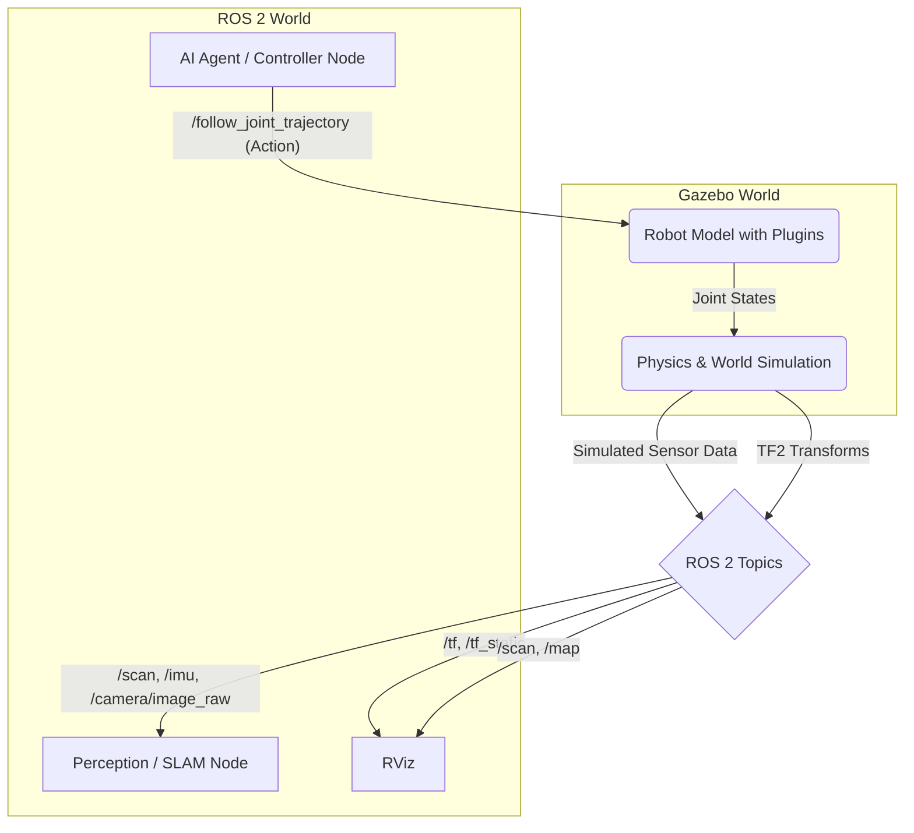

# 5. Building a Complete Humanoid Simulation

We've learned about physics in Gazebo, rendering in Unity, and simulating sensors. Now it's time to assemble all these components into a complete, end-to-end digital twin of our humanoid robot.

Our goal is to create a simulation that is fully controlled and monitored through ROS 2. An AI agent should be able to send commands and receive sensor data from the simulated robot, just as it would with the physical hardware. This is called creating a **closed-loop simulation**.

## The Full Architecture

Let's look at the complete architecture of our digital twin setup, using Gazebo as the simulator.



### Breakdown of the Loop:

1.  **Control**: Our AI agent (for now, a simple Python node) decides on an action, like "wave the arm." It sends this command as a goal to the `/follow_joint_trajectory` action server.
2.  **Simulation**: A `ros2_control` plugin within Gazebo receives this goal. It uses Gazebo's physics engine to calculate how the robot's joints should move to achieve the trajectory.
3.  **State Feedback**: The Gazebo simulator constantly updates the state of the robot model.
4.  **Sensor Publication**: The sensor plugins we attached to our robot model (cameras, LiDAR, IMU) render the simulated world from their perspective and publish the results to ROS 2 topics like `/scan` and `/camera/image_raw`.
5.  **Transform Publication**: The `ros2_control` plugin also publishes the real-time position of all the robot's links to the `/tf` topic.
6.  **Perception**: A perception or SLAM (Simultaneous Localization and Mapping) node subscribes to the sensor and TF topics to build a map of the environment or detect objects.
7.  **Visualization**: RViz subscribes to `/tf`, `/map`, `/scan`, and other topics to provide a real-time 3D visualization of what the robot is "thinking." It shows the robot's position, the map it's building, and the sensor data it's receiving.

This entire system runs on your computer. You can write code, run your simulation, and debug your algorithms, all without needing a physical robot.

## The Importance of `ros2_control`

In Module 1, we published directly to `/joint_states` to control our robot in RViz. This is a simple approach that works for visualization, but it's not how real robots (or high-fidelity simulations) are controlled.

For a more realistic simulation, we use the **`ros2_control`** framework. `ros2_control` is a standard and generalized way to interface with robot hardware. By adding the `ros2_control` Gazebo plugin to our robot's description, we get a much more powerful and realistic interface.

Instead of just publishing a target position, `ros2_control` allows us to use sophisticated controllers, such as a `joint_trajectory_controller`. This controller:
- Exposes a `FollowJointTrajectory` action server.
- Accepts a goal containing a sequence of points with positions, velocities, and accelerations.
- Runs a PID (Proportional-Integral-Derivative) control loop inside the simulator to ensure the robot's joints follow the trajectory accurately.

This is much closer to how a real robot arm works. Your high-level AI agent simply needs to provide a target trajectory, and `ros2_control` handles the low-level work of making the joints follow it.

## The Power of Launch Files

As you can see, our system now has many moving parts:
- The Gazebo simulator itself.
- A node to spawn the robot model.
- The `robot_state_publisher`.
- The `joint_state_broadcaster` (part of `ros2_control`).
- The `joint_trajectory_controller` (part of `ros2_control`).
- Our own AI agent / controller nodes.
- RViz for visualization.

Starting all of these manually in separate terminals would be tedious and error-prone. This is why we use **ROS 2 launch files**. A launch file is a Python script that lets you define all the nodes you want to run, their parameters, and their configurations, and then start them all with a single command:

```bash
ros2 launch my_robot_simulation full_simulation.launch.py
```

This single command can bring up your entire digital twin environment, ready for testing.

In the exercises, we will provide a complete launch file that starts a Gazebo world, spawns our humanoid, and gets it ready to receive commands. This complete, closed-loop simulation will be the foundation for everything we build in the rest of this textbook.
