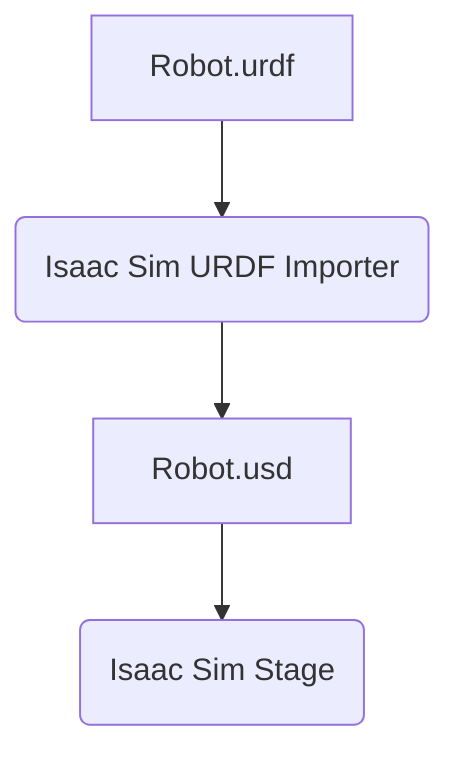

# 2. Isaac Sim and Photorealistic Rendering

NVIDIA's Isaac Sim is not just another robotics simulator; it's a platform built for the age of AI. Its core strength lies in its ability to generate **physically-based, photorealistic sensor data**. This is a game-changer for training and testing the AI models that power modern robots.

This chapter provides an overview of the Isaac Sim interface and workflow, with a focus on its rendering capabilities.

## The Isaac Sim Interface

Isaac Sim is built on top of NVIDIA Omniverse and uses the Universal Scene Description (USD) format for describing scenes. When you open Isaac Sim, you're presented with a powerful 3D editor that will feel familiar if you've ever used a game engine like Unity or Unreal.

The key windows are:
- **Viewport**: The main window where you see and interact with your 3D scene. You can switch between real-time rendering and interactive path tracing for maximum realism.
- **Stage**: A hierarchical view of every object (or "prim") in your scene, from robots and lights to cameras and individual meshes.
- **Property Panel**: Displays all the properties of the currently selected object, allowing you to modify everything from its color and texture to its physical mass and ROS 2 interface.
- **Content Browser**: Your file system for accessing assets like 3D models, materials, and environments.

## From URDF to USD

While Isaac Sim can import URDF files, it has a much richer, more expressive internal format called **Universal Scene Description (USD)**. USD is an open-source 3D scene description format developed by Pixar that is designed for large-scale, collaborative projects.

Isaac Sim includes a URDF Importer tool that automatically converts your robot's URDF file into a USD file. During this process, it converts:
- `<link>` tags into `Xform` prims with `Mesh` children.
- `<joint>` tags into `Articulation` joints (e.g., `RevoluteJoint`).
- `<inertial>` and `<collision>` tags into physics properties.

The result is a native USD representation of your robot that can be fully manipulated within the Isaac Sim editor and simulated with the PhysX engine.



## The Power of RTX Rendering

The "magic" of Isaac Sim's visual quality comes from its integration with NVIDIA's RTX rendering technology.

- **Real-Time Ray Tracing**: Unlike traditional rasterization which "fakes" lighting, ray tracing simulates the actual path of light rays as they bounce around a scene. This produces incredibly realistic lighting, shadows, reflections, and refractions.
- **Physically-Based Materials**: In Isaac Sim, materials are defined by their real-world physical properties (like roughness, metallicity, and index of refraction). A "metal" material doesn't just look metallic; it reflects light like real metal. This ensures that what your robot's camera sees in the simulation is a faithful representation of what it would see in the real world.

This level of realism is crucial for **synthetic data generation**. If you train a neural network to detect a red ball on a shiny floor using images from Isaac Sim, that model has a much better chance of working correctly with a real camera in the real world, because the simulated images were physically accurate.

## Setting Up a Basic Simulation

The workflow for setting up a robot simulation in Isaac Sim is typically done through its Python scripting interface. Isaac Sim exposes a powerful Python API that lets you programmatically build and control every aspect of the simulation.

A typical setup script would look like this:

```python
# Import the necessary simulation libraries
from omni.isaac.kit import SimulationApp

# Configuration for the simulation
config = {"renderer": "RayTracedLighting", "headless": False}
simulation_app = SimulationApp(config)

from omni.isaac.core import World
from omni.isaac.core.objects import VisualCuboid

# Create a World object
my_world = World()

# Add a simple cube to the world
my_world.scene.add(
    VisualCuboid(
        prim_path="/World/my_cube",
        position=[0, 0, 1.0],
        scale=[0.5, 0.5, 0.5],
        color=[0.0, 0.0, 1.0] # Blue
    )
)

# Add the world to the simulation context and "play" the simulation
my_world.reset()
while simulation_app.is_running():
    my_world.step(render=True)

# Cleanup
simulation_app.close()
```

### Script Breakdown
1.  **`SimulationApp`**: This is the main application class that initializes the simulation context, including the renderer.
2.  **`World`**: This class represents the simulation world and provides an easy way to add objects and robots.
3.  **`my_world.scene.add(...)`**: We add a simple blue cube to the scene.
4.  **`my_world.reset()`**: This prepares the scene for simulation.
5.  **`while simulation_app.is_running()`**: This is the main simulation loop.
6.  **`my_world.step(render=True)`**: This is the most important line. It tells the simulation to advance one step in time, running the physics engine and rendering the scene.

This Python-first approach makes it incredibly easy to automate simulation tasks, which is essential for large-scale testing and data generation. In the next chapter, we'll see how to add the ROS 2 bridge to this script to connect our simulation to the ROS ecosystem.
