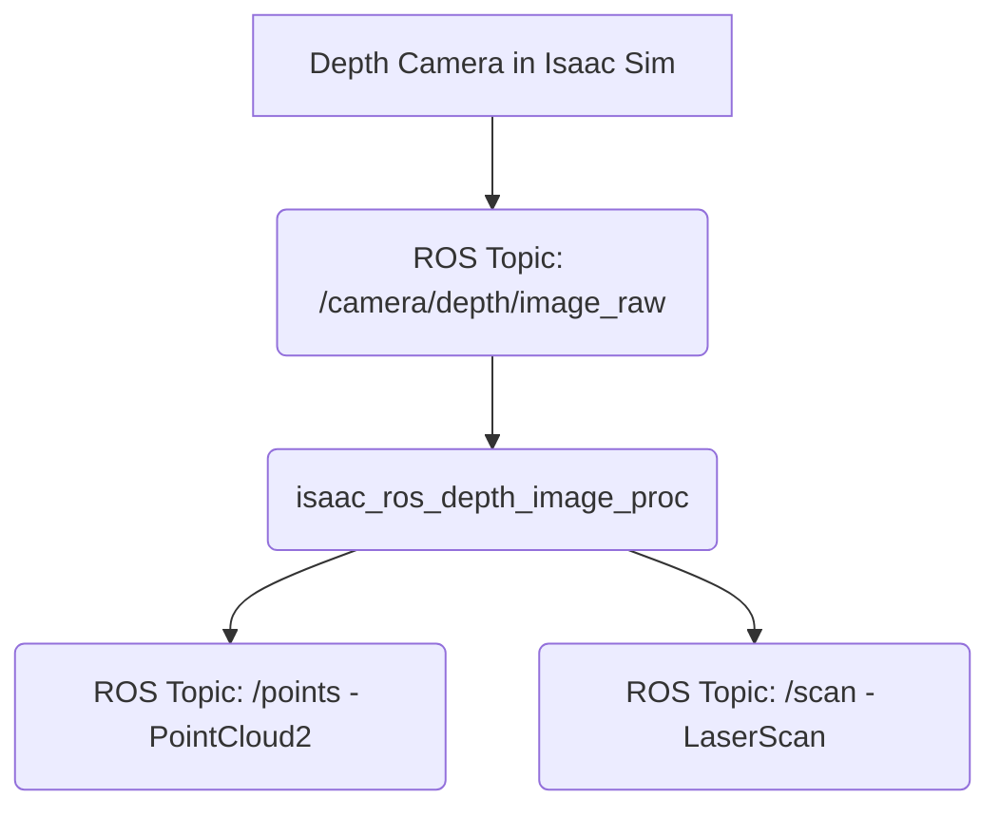

# 4. VSLAM and 3D Perception with Isaac ROS

Now that we have a GPU-accelerated perception pipeline, let's use it to give our robot two critical abilities: the ability to know where it is, and the ability to "see" in 3D.

## Visual SLAM: Knowing Where You Are

**SLAM** stands for **S**imultaneous **L**ocalization **a**nd **M**apping. It's the process of placing a robot in an unknown environment and having it build a map of that environment while simultaneously keeping track of its own location within that map.

**Visual SLAM (VSLAM)** is a type of SLAM that uses one or more cameras as its primary sensor. This is how modern VR headsets track their position in a room and how many autonomous drones navigate.

The **`isaac_ros_visual_slam`** GEM is a powerful, hardware-accelerated package that performs this task. It subscribes to stereo camera images and IMU data and publishes several important outputs:
- **`/tf`**: It publishes the transform between the robot's odometry frame (`odom`) and its base frame (`base_link`), providing a real-time estimate of the robot's trajectory.
- **`/map`**: It can publish a 3D point cloud map of the environment it has explored.
- **`/pose`**: It publishes the robot's estimated pose within the map.

### How It Works
The `isaac_ros_visual_slam` node constantly tracks hundreds of visual features (corners, edges) in the camera images. By observing how these features move from one frame to the next, it can calculate the camera's motion. This visual information is then fused with the IMU data (which measures acceleration and rotational velocity) in a sophisticated filter to produce a highly accurate and robust pose estimate, even during fast movements.

Because it runs entirely on the GPU, it can perform this complex calculation in real-time, often at rates exceeding 100 Hz.

## Depth Perception: Seeing in 3D

Standard cameras provide 2D images. But for a robot to navigate and interact with the world, it needs to understand the 3D structure of its environment. This is where **depth cameras** come in. A depth camera produces an image where each pixel's value corresponds to its distance from the camera.

Isaac Sim is exceptionally good at generating this data. You can add a depth camera sensor to your robot that will provide perfect, per-pixel depth information.

However, a raw depth image isn't always the most useful representation. For tasks like obstacle avoidance and navigation, it's often better to convert this depth data into a different format. This is where the **`isaac_ros_depth_image_proc`** GEM comes in.

### From Depth Image to Point Cloud
A **point cloud** is a collection of points in 3D space. It's a very common and useful way to represent 3D sensor data in robotics. The `isaac_ros_depth_image_proc` package contains a node that can take a raw depth image and, using the camera's calibration information, convert it into a `sensor_msgs/msg/PointCloud2` message.

### From Depth Image to Laser Scan
The ROS 2 navigation stack (Nav2), which we will cover in the next chapter, was originally designed to work with 2D LiDAR sensors that produce `sensor_msgs/msg/LaserScan` messages. The `isaac_ros_depth_image_proc` package also includes a node that can convert a 3D depth image into a "fake" 2D laser scan. It does this by taking a horizontal slice of the depth data and projecting it onto a 2D plane. This allows a robot with only a depth camera to use the powerful and mature 2D navigation tools available in ROS.

## The Complete Perception Pipeline

By combining these Isaac ROS GEMs, we can build a complete, high-performance perception system for our robot.

1.  **Isaac Sim** generates photorealistic stereo images, depth images, and IMU data.
2.  The **`isaac_ros_visual_slam`** node consumes the stereo images and IMU data to calculate the robot's real-time position and build a map of the world.
3.  The **`isaac_ros_depth_image_proc`** node consumes the depth image and converts it into a 2D laser scan for the navigation system and a 3D point cloud for obstacle avoidance or object recognition.

This entire pipeline runs with incredible efficiency thanks to GPU acceleration. The result is a robot that has a rich, real-time, 3D understanding of its environment, forming the foundation upon which we can build intelligent behaviors. In the next chapter, we'll use this foundation to enable our humanoid to navigate its world autonomously.
