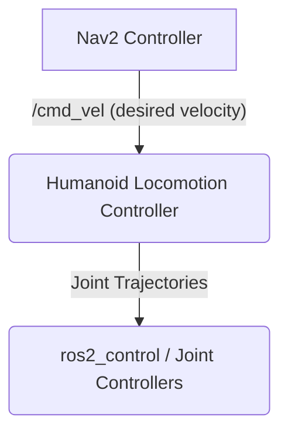

# 5. Autonomous Navigation with Nav2

We have given our robot the ability to "see" and "locate" itself in a map. The next logical step is to give it the ability to move from point A to point B on its own. This is the domain of **navigation**, and in ROS 2, the industry-standard solution is the **Navigation2** stack, or **Nav2**.

## What is Nav2?

Nav2 is a powerful, highly configurable, and production-ready software stack for autonomous robot navigation. It takes sensor data, a map, and a goal pose as inputs, and it outputs velocity commands to move the robot to the goal while avoiding obstacles.

Nav2 is not a single node, but a complex system of interacting servers, each responsible for a piece of the navigation puzzle.

```mermaid
graph TD
    subgraph User / AI Agent
        A[Goal Pose (e.g., from RViz or code)]
    end
    subgraph Nav2 Stack
        B(Navigator)
        C(Global Planner)
        D(Local Planner / Controller)
        E(Costmaps)
    end
    subgraph Robot Hardware / Simulation
        F(Robot Base)
    end

    A -- "Navigate to this pose!" --> B;
    B -- "Plan a path from A to B" --> C;
    C -- Global Path --> D;
    E -- Obstacle Data --> C;
    E -- Obstacle Data --> D;
    D -- "/cmd_vel" --> F;
```

### Key Components of Nav2

1.  **Costmaps (`costmap_2d`)**: This is the foundation of Nav2's planning. Nav2 maintains two costmaps:
    - **Global Costmap**: A 2D grid that represents the entire known environment. It's built from the static map provided by SLAM and is used by the global planner.
    - **Local Costmap**: A smaller, rolling window around the robot that is constantly updated with real-time sensor data (like the `/scan` topic from our depth camera). It represents the immediate surroundings and is used by the local planner to avoid dynamic obstacles.
    In both costmaps, each cell has a value representing how "costly" it is to travel through it. Cells with obstacles have a very high cost.

2.  **Global Planner (`nav2_planner`)**: When you send a goal to Nav2, the global planner is responsible for finding the optimal path from the robot's current location to the goal on the global costmap. It uses algorithms like A* or Dijkstra to find the shortest path while avoiding known, static obstacles.

3.  **Local Planner / Controller (`nav2_controller`)**: The local planner (also called the controller) is responsible for actually executing the global plan. It looks at the global path, the local costmap, and the robot's current state, and it computes a valid velocity command (`/cmd_vel`) to send to the robot's base. Its job is to follow the global path while avoiding any immediate obstacles (like a person walking in front of the robot) that weren't in the original map.

4.  **Navigator**: The top-level action server that coordinates the whole process. When it receives a `NavigateToPose` action goal, it orchestrates calls to the planner and controller until the goal is reached, fails, or is cancelled.

## Integrating Isaac ROS with Nav2

Nav2 is the perfect consumer for the data generated by our Isaac ROS perception pipeline.

- **Input for Localization**: The VSLAM system (`isaac_ros_visual_slam`) provides the essential `/tf` transform from the map frame to the odometry frame, constantly telling Nav2 where the robot is.
- **Input for Obstacle Avoidance**: The depth camera processing pipeline (`isaac_ros_depth_image_proc`) provides the `/scan` topic, which the local costmap uses to detect and avoid immediate obstacles.

By feeding the high-quality, low-latency data from our GPU-accelerated GEMs into Nav2, we can achieve very robust and performant navigation.

## Bipedal vs. Wheeled Navigation

A critical point for our humanoid robot is that Nav2 was originally designed for **wheeled robots**. It operates on a 2.5D costmap and outputs `Twist` messages (linear x/y velocity and angular z velocity), which are perfect for a differential-drive robot.

This presents a challenge for a bipedal humanoid. A humanoid cannot simply spin in place or move sideways. Its motion is constrained by the dynamics of walking.

To solve this, we need an intermediate "locomotion controller" node. This node's job is to:
1.  **Subscribe** to the `/cmd_vel` topic from Nav2.
2.  **Translate** the desired linear and angular velocities into a stable walking gait. This might involve sending commands to a whole-body controller or a pattern generator that controls the legs.
3.  **Publish** the resulting joint trajectories to the robot's joint controllers.



This is a non-trivial problem and an active area of robotics research. For this textbook, we will often simplify the problem by starting with a wheeled base for our robot before moving on to the full complexity of bipedal locomotion.

In the next chapter, we'll put all the pieces of our AI brain together, connecting perception, planning, and control into a single, cohesive system.
