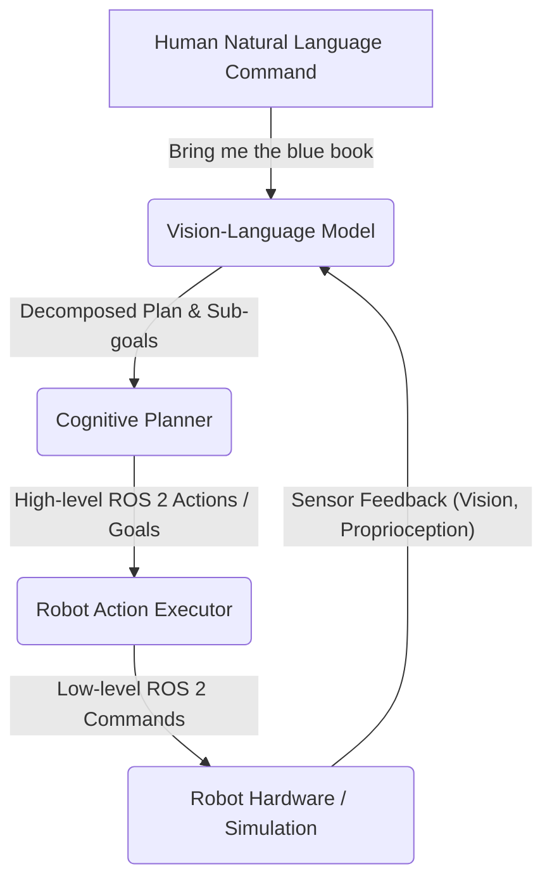

# 1. Vision-Language-Action (VLA): The Future of Robotics

So far, our robot has a nervous system (ROS 2), a physical body (URDF), a simulated world (Gazebo/Isaac Sim), and a brain that perceives its environment and plans paths (Isaac ROS/Nav2). What's missing? The ability to understand and execute high-level, human-like commands.

This is the domain of **Vision-Language-Action (VLA)** models. VLAs represent a paradigm shift in robotics, moving from rigidly programmed behaviors to flexible, intelligent agents that can interpret natural language, understand visual cues, and perform complex tasks in the real world.

## The Bottleneck: Programming Every Action

Traditionally, instructing a robot to perform a task like "Go to the kitchen, find the red cup, and bring it to me" would require:
1.  **Hardcoding navigation**: Defining exact waypoints, or relying on pre-programmed maps.
2.  **Hardcoding object recognition**: Writing specific computer vision algorithms to detect a "red cup."
3.  **Hardcoding manipulation**: Pre-defining the sequence of arm movements to grasp a cup.
4.  **Hardcoding task logic**: Writing if/else statements for every possible scenario.

This approach is brittle, unscalable, and requires extensive engineering effort for every new task or environment.

## The VLA Revolution: Bridging Language and Action

VLAs leverage the power of **Large Language Models (LLMs)** and **Large Vision Models (LVMs)**, often combined, to create general-purpose robotic agents. Instead of meticulously programming every step, you can simply tell the robot what you want it to do in natural language.

The core idea is to enable robots to:
1.  **Understand natural language instructions**: "Bring me the water bottle"
2.  **Perceive and understand the visual world**: Identify the "water bottle" and its location.
3.  **Ground language in physical actions**: Translate "bring" into a sequence of navigation, grasping, and delivery actions.
4.  **Perform complex, multi-step tasks**: Break down the overall goal into sub-goals and execute them.

## How VLAs Work (A High-Level Overview)

A VLA pipeline typically involves several stages:

### 1. Vision-Language Model (VLM)
This is the core intelligence. It takes the natural language instruction and often combines it with visual information from the robot's cameras. The VLM's role is to:
- **Parse the command**: Understand the intent ("bring," "find," "stack").
- **Identify entities**: Pinpoint "blue book" in the visual scene.
- **Decompose the task**: Break "bring the blue book" into sub-tasks like "navigate to shelf," "identify blue book," "grasp blue book," "navigate to human," "hand over book."

These VLMs are typically massive neural networks pre-trained on vast datasets of text and images, allowing them to generalize to new tasks and objects without explicit programming.

### 2. Cognitive Planner
The VLM often outputs a high-level, semantic plan (e.g., "pick blue book"). The Cognitive Planner's job is to translate this semantic plan into a sequence of concrete, executable ROS 2 actions that the robot can perform. This might involve:
- **Retrieving skills**: Looking up pre-defined robot skills (e.g., `pick(object_id)`, `navigate_to(location)`).
- **Sequencing actions**: Ordering the skills logically.
- **Handling preconditions/postconditions**: Ensuring the robot is in the correct state before executing an action.

### 3. Robot Action Executor
This component takes the concrete ROS 2 actions (e.g., `navigate_to_pose(target_pose)`, `follow_joint_trajectory(grasp_trajectory)`) and translates them into the low-level ROS 2 messages that control the robot's base, arms, and grippers. This is where our Nav2 stack and `ros2_control` systems come into play.

### 4. Sensor Feedback
Crucially, the entire loop is closed with sensor feedback. The robot continuously perceives its environment, and this visual and proprioceptive (body position) information is fed back to the VLM and planner, allowing it to adapt to dynamic environments, correct errors, and verify task completion.

## The Promise of VLA

VLA models promise to unlock a new generation of robots that are:
- **More adaptable**: Easily learn new tasks without reprogramming.
- **More robust**: Handle unexpected situations by reasoning about the world.
- **More intuitive**: Interact naturally with humans using language.

In this module, we will explore practical examples of building VLA pipelines, starting with how to interpret voice commands, translate them into actions, and integrate them with our existing robot control systems.
