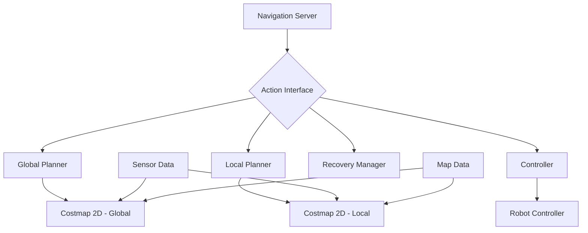

# Navigation 2 (Nav2) for Humanoid Robots

Navigation 2 (Nav2) is the latest navigation stack for ROS 2, designed to provide robust, reliable, and efficient navigation for mobile robots. For humanoid robots, Nav2 provides the essential capabilities needed to navigate complex, human-centric environments safely and efficiently.

## Overview of Nav2

Nav2 is a complete re-architecture of the ROS navigation stack, built specifically for ROS 2. It provides:

- **Behavior Trees**: For complex navigation behaviors
- **Plugin Architecture**: For customizable navigation components
- **Improved Safety**: With better collision avoidance and recovery
- **Enhanced Performance**: With modern C++ implementation

For humanoid robots, Nav2 offers specialized capabilities to handle the unique challenges of bipedal locomotion and human-scale environments.

## Nav2 Architecture

### 1. Core Components

Nav2 consists of several key components:



### 2. Behavior Trees in Nav2

Behavior trees allow complex navigation behaviors to be composed from simpler actions:

```xml
<root main_tree_to_execute="MainTree">
    <BehaviorTree ID="MainTree">
        <Sequence name="NavigateWithRecovery">
            <PipelineSequence name="global_plan">
                <RecoveryNode number_of_retries="6">
                    <ComputePathToPose goal="{goal}" path="{path}" planner_id="GridBased"/>
                    <ClearEntirely name="Clear Global Costmap" service_name="global_costmap/clear_entirely"/>
                </RecoveryNode>
            </PipelineSequence>
            
            <PipelineSequence name="local_plan">
                <RecoveryNode number_of_retries="6">
                    <FollowPath path="{path}" controller_id="FollowPath"/>
                    <ClearEntirely name="Clear Local Costmap" service_name="local_costmap/clear_entirely"/>
                </RecoveryNode>
            </PipelineSequence>
        </Sequence>
    </BehaviorTree>
</root>
```

## Nav2 Installation and Setup

### 1. Installing Nav2

```bash
# Install Nav2 packages
sudo apt update
sudo apt install ros-humble-navigation2
sudo apt install ros-humble-nav2-bringup
sudo apt install ros-humble-nav2-gui-plugins
sudo apt install ros-humble-nav2-rviz-plugins
```

### 2. Basic Nav2 Launch

```python
# launch/humanoid_nav2.launch.py
import os
from launch import LaunchDescription
from launch.actions import DeclareLaunchArgument, SetEnvironmentVariable
from launch.substitutions import LaunchConfiguration
from launch_ros.actions import Node
from nav2_common.launch import RewrittenYaml


def generate_launch_description():
    # Launch arguments
    use_sim_time = LaunchConfiguration('use_sim_time')
    autostart = LaunchConfiguration('autostart')
    params_file = LaunchConfiguration('params_file')
    
    # Create launch description
    ld = LaunchDescription()
    
    # Declare launch arguments
    declare_use_sim_time = DeclareLaunchArgument(
        'use_sim_time', 
        default_value='false',
        description='Use simulation time if true'
    )
    
    declare_autostart = DeclareLaunchArgument(
        'autostart', 
        default_value='true',
        description='Automatically start the nav2 stack'
    )
    
    declare_params_file = DeclareLaunchArgument(
        'params_file',
        default_value=os.path.join(
            get_package_share_directory('my_humanoid_package'),
            'config',
            'nav2_params.yaml'
        ),
        description='Full path to the ROS2 parameters file to use for all launched nodes'
    )
    
    # Create the Nav2 node
    nav2_node = Node(
        package='nav2_bt_navigator',
        executable='bt_navigator',
        name='bt_navigator',
        output='screen',
        parameters=[params_file, {'use_sim_time': use_sim_time}]
    )
    
    # Add actions to launch description
    ld.add_action(declare_use_sim_time)
    ld.add_action(declare_autostart)
    ld.add_action(declare_params_file)
    ld.add_action(nav2_node)
    
    return ld
```

## Configuration for Humanoid Robots

### 1. Nav2 Parameters for Humanoid Robots

```yaml
# config/nav2_params.yaml
amcl:
  ros__parameters:
    use_sim_time: False
    alpha1: 0.2
    alpha2: 0.2
    alpha3: 0.2
    alpha4: 0.2
    alpha5: 0.2
    base_frame_id: "base_footprint"
    beam_skip_distance: 0.5
    beam_skip_error_threshold: 0.9
    beam_skip_threshold: 0.3
    do_beamskip: false
    global_frame_id: "map"
    lambda_short: 0.1
    laser_likelihood_max_dist: 2.0
    laser_max_range: 100.0
    laser_min_range: -1.0
    laser_model_type: "likelihood_field"
    max_beams: 60
    max_particles: 2000
    min_particles: 500
    odom_frame_id: "odom"
    pf_err: 0.05
    pf_z: 0.99
    recovery_alpha_fast: 0.0
    recovery_alpha_slow: 0.0
    resample_interval: 1
    robot_model_type: "nav2_amcl::DifferentialMotionModel"
    save_pose_rate: 0.5
    sigma_hit: 0.2
    tf_broadcast: true
    transform_tolerance: 1.0
    update_min_a: 0.2
    update_min_d: 0.25
    z_hit: 0.5
    z_max: 0.05
    z_rand: 0.5
    z_short: 0.05

amcl_map_client:
  ros__parameters:
    use_sim_time: False

amcl_rclcpp_node:
  ros__parameters:
    use_sim_time: False

bt_navigator:
  ros__parameters:
    use_sim_time: False
    global_frame: map
    robot_base_frame: base_footprint
    odom_topic: /odom
    bt_loop_duration: 10
    default_server_timeout: 20
    enable_groot_monitoring: True
    groot_zmq_publisher_port: 1666
    groot_zmq_server_port: 1667
    # Specify the path where the behavior tree file is located
    default_nav_through_poses_bt_xml: "humanoid_navigate_through_poses_w_replanning_and_recovery.xml"
    default_nav_to_pose_bt_xml: "humanoid_navigate_to_pose_w_replanning_and_recovery.xml"
    plugin_lib_names:
    - nav2_compute_path_to_pose_action_bt_node
    - nav2_compute_path_through_poses_action_bt_node
    - nav2_smooth_path_action_bt_node
    - nav2_follow_path_action_bt_node
    - nav2_spin_action_bt_node
    - nav2_wait_action_bt_node
    - nav2_assisted_teleop_action_bt_node
    - nav2_back_up_action_bt_node
    - nav2_drive_on_heading_bt_node
    - nav2_clear_costmap_service_bt_node
    - nav2_is_stuck_condition_bt_node
    - nav2_have_feedback_condition_bt_node
    - nav2_have_recovery_attempts_condition_bt_node
    - nav2_external_condition
    - nav2_recovery_node_bt_node
    - nav2_pipeline_sequence_bt_node
    - nav2_round_robin_node_bt_node
    - nav2_transform_available_condition_bt_node
    - nav2_time_expired_condition_bt_node
    - nav2_distance_traveled_condition_bt_node
    - nav2_single_trigger_bt_node
    - nav2_is_battery_low_condition_bt_node
    - nav2_navigate_through_poses_action_bt_node
    - nav2_navigate_to_pose_action_bt_node
    - nav2_remove_passed_goals_action_bt_node
    - nav2_planner_selector_bt_node
    - nav2_controller_selector_bt_node
    - nav2_goal_checker_selector_bt_node
    - nav2_controller_cancel_bt_node
    - nav2_path_longer_on_approach_bt_node
    - nav2_reinitialize_global_localization_service_bt_node
    - nav2_rate_controller_bt_node
    - nav2_distance_controller_bt_node
    - nav2_speed_controller_bt_node
    - nav2_truncate_path_action_bt_node
    - nav2_truncate_path_local_action_bt_node
    - nav2_goal_updater_node_bt_node
    - nav2_recovery_triggerer_bt_node
    - nav2_wait_cancel_bt_node
    - nav2_spin_cancel_bt_node
    - nav2_back_up_cancel_bt_node
    - nav2_assisted_teleop_cancel_bt_node
    - nav2_drive_on_heading_cancel_bt_node

bt_navigator_rclcpp_node:
  ros__parameters:
    use_sim_time: False

controller_server:
  ros__parameters:
    use_sim_time: False
    controller_frequency: 20.0
    min_x_velocity_threshold: 0.001
    min_y_velocity_threshold: 0.5
    min_theta_velocity_threshold: 0.001
    # Humanoid-specific controllers
    progress_checker_plugin: "progress_checker"
    goal_checker_plugin: "goal_checker"
    controller_plugins: ["FollowPath"]
    
    # Humanoid path follower
    FollowPath:
      plugin: "nav2_mppi_controller::MPPIController"
      time_steps: 50
      model_dt: 0.05
      batch_size: 1000
      vx_std: 0.2
      vy_std: 0.2
      wz_std: 0.3
      vx_max: 0.5
      vx_min: -0.2
      vy_max: 0.3
      vy_min: -0.3
      wz_max: 0.5
      wz_min: -0.5
      xy_goal_tolerance: 0.25
      yaw_goal_tolerance: 0.1
      goal_checker: "simple_goal_checker"
      path_publisher: "path_pub"
      critic_names: [
        "ConstraintCritic",
        "GoalCritic",
        "ObstacleCritic",
        "PreferForwardCritic",
        "TowardGoalCritic",
        "TwirlingCritic"
      ]
      ConstraintCritic.scale: 1.0
      GoalCritic.scale: 2.0
      ObstacleCritic.scale: 2.0
      ObstacleCritic.threshold_to_remember: 1.0
      PreferForwardCritic.scale: 0.5
      TowardGoalCritic.scale: 3.0
      TowardGoalCritic.lookahead_resolution: 0.5
      TowardGoalCritic.lookahead_time: 1.0
      TwirlingCritic.scale: 1.0

controller_server_rclcpp_node:
  ros__parameters:
    use_sim_time: False

# Global Costmap Configuration for Humanoid Robots
global_costmap:
  global_costmap:
    ros__parameters:
      update_frequency: 1.0
      publish_frequency: 1.0
      global_frame: map
      robot_base_frame: base_footprint
      use_sim_time: False
      robot_radius: 0.3  # Humanoid robot radius
      resolution: 0.05
      track_unknown_space: true
      plugins: ["static_layer", "obstacle_layer", "inflation_layer"]
      obstacle_layer:
        plugin: "nav2_costmap_2d::ObstacleLayer"
        enabled: True
        observation_sources: scan
        scan:
          topic: /scan
          max_obstacle_height: 2.0  # Humanoid height consideration
          clearing: True
          marking: True
          data_type: "LaserScan"
          raytrace_max_range: 3.0
          raytrace_min_range: 0.0
          obstacle_max_range: 2.5
          obstacle_min_range: 0.0
      static_layer:
        plugin: "nav2_costmap_2d::StaticLayer"
        map_subscribe_transient_local: True
      inflation_layer:
        plugin: "nav2_costmap_2d::InflationLayer"
        cost_scaling_factor: 3.0
        inflation_radius: 0.55
      always_send_full_costmap: True

global_costmap_rclcpp_node:
  ros__parameters:
    use_sim_time: False

# Local Costmap Configuration for Humanoid Robots
local_costmap:
  local_costmap:
    ros__parameters:
      update_frequency: 5.0
      publish_frequency: 2.0
      global_frame: odom
      robot_base_frame: base_footprint
      use_sim_time: False
      robot_radius: 0.3  # Humanoid robot radius
      resolution: 0.05
      width: 6
      height: 6
      plugins: ["obstacle_layer", "voxel_layer", "inflation_layer"]
      obstacle_layer:
        plugin: "nav2_costmap_2d::ObstacleLayer"
        enabled: True
        observation_sources: scan
        scan:
          topic: /scan
          max_obstacle_height: 2.0
          clearing: True
          marking: True
          data_type: "LaserScan"
          raytrace_max_range: 3.0
          raytrace_min_range: 0.0
          obstacle_max_range: 2.5
          obstacle_min_range: 0.0
      voxel_layer:
        plugin: "nav2_costmap_2d::VoxelLayer"
        enabled: True
        publish_voxel_map: True
        origin_z: 0.0
        z_resolution: 0.2
        z_voxels: 10
        max_obstacle_height: 2.0
        mark_threshold: 0
        observation_sources: pointcloud
        pointcloud:
          topic: /humanoid_depth/points
          max_obstacle_height: 2.0
          clearing: True
          marking: True
          data_type: "PointCloud2"
          min_obstacle_height: 0.0
          obstacle_range: 2.5
          raytrace_range: 3.0
          transform_tolerance: 0.2
          observation_persistence: 0.0
          expected_update_rate: 0.0
      inflation_layer:
        plugin: "nav2_costmap_2d::InflationLayer"
        cost_scaling_factor: 3.0
        inflation_radius: 0.55
      always_send_full_costmap: True

local_costmap_rclcpp_node:
  ros__parameters:
    use_sim_time: False

planner_server:
  ros__parameters:
    expected_planner_frequency: 20.0
    use_sim_time: False
    planner_plugins: ["GridBased"]
    GridBased:
      plugin: "nav2_navfn_planner::NavfnPlanner"
      tolerance: 0.5
      use_astar: false
      allow_unknown: true

planner_server_rclcpp_node:
  ros__parameters:
    use_sim_time: False

recoveries_server:
  ros__parameters:
    costmap_topic: local_costmap/costmap_raw
    footprint_topic: local_costmap/published_footprint
    cycle_frequency: 10.0
    recovery_plugins: ["spin", "backup", "wait"]
    spin:
      plugin: "nav2_recoveries::Spin"
      rotation_speed: 0.5  # Slower for humanoid stability
      max_rotation_attempts: 17
    backup:
      plugin: "nav2_recoveries::BackUp"
      backup_dist: -0.15  # Conservative for humanoid
      backup_speed: 0.05
    wait:
      plugin: "nav2_recoveries::Wait"
      wait_duration: 1.0

robot_state_publisher:
  ros__parameters:
    use_sim_time: False
```

### 2. Humanoid-Specific Behavior Trees

For humanoid robots, we need specialized behavior trees that consider bipedal locomotion:

```xml
<!-- humanoid_navigate_to_pose_w_replanning_and_recovery.xml -->
<root main_tree_to_execute="MainTree">
    <BehaviorTree ID="MainTree">
        <RecoveryNode number_of_retries="4" name="NavigateRecovery">
            <PipelineSequence name="NavigateWithReplanning">
                <RateController hz="1.0">
                    <ComputePathToPose goal="{goal}" path="{path}" planner_id="GridBased"/>
                </RateController>
                <RecoveryNode number_of_retries="4" name="FollowPathRecovery">
                    <FollowPath path="{path}" controller_id="FollowPath"/>
                    <ReactiveFallback name="FollowPathWithRecoveryFallback">
                        <GoalReached goal="{goal}"/>
                        <ClearEntirely service_name="local_costmap/clear_entirely"/>
                    </ReactiveFallback>
                </RecoveryNode>
            </PipelineSequence>
            <ReactiveFallback name="RecoveryFallback">
                <ClearEntirely service_name="local_costmap/clear_entirely"/>
                <ClearEntirely service_name="global_costmap/clear_entirely"/>
            </ReactiveFallback>
        </RecoveryNode>
    </BehaviorTree>
</root>
```

## Humanoid Navigation Controllers

### 1. Balance-Aware Path Following

```python
import rclpy
from rclpy.node import Node
from geometry_msgs.msg import Twist, PoseStamped
from nav_msgs.msg import Path
from sensor_msgs.msg import Imu
import numpy as np
from scipy.spatial.transform import Rotation as R

class BalanceAwareController(Node):
    def __init__(self):
        super().__init__('balance_aware_controller')
        
        # Subscriptions
        self.imu_sub = self.create_subscription(
            Imu, '/imu/data', self.imu_callback, 10
        )
        
        self.path_sub = self.create_subscription(
            Path, '/plan', self.path_callback, 10
        )
        
        # Publishers
        self.cmd_vel_pub = self.create_publisher(Twist, '/cmd_vel', 10)
        
        # Parameters
        self.max_linear_vel = 0.3  # Conservative for balance
        self.max_angular_vel = 0.3
        self.balance_threshold = 0.2  # Radians
        
        # State
        self.current_imu_orientation = np.array([0.0, 0.0, 0.0, 1.0])
        self.current_path = None
        self.path_index = 0
        self.is_balanced = True
        
        # Timer for control loop
        self.control_timer = self.create_timer(0.05, self.control_loop)
    
    def imu_callback(self, msg):
        """Update robot orientation from IMU"""
        self.current_imu_orientation = np.array([
            msg.orientation.x,
            msg.orientation.y,
            msg.orientation.z,
            msg.orientation.w
        ])
        
        # Check if robot is balanced
        self.is_balanced = self.check_balance()
    
    def check_balance(self):
        """Check if robot is within balance limits"""
        # Convert quaternion to Euler angles
        r = R.from_quat(self.current_imu_orientation)
        euler = r.as_euler('xyz')
        
        # Check if roll or pitch exceeds threshold
        return abs(euler[0]) < self.balance_threshold and abs(euler[1]) < self.balance_threshold
    
    def path_callback(self, msg):
        """Update path to follow"""
        self.current_path = msg.poses
        self.path_index = 0
    
    def control_loop(self):
        """Main control loop"""
        if not self.current_path or not self.is_balanced:
            # Stop if no path or not balanced
            self.publish_stop_command()
            return
        
        # Calculate control command
        cmd_vel = self.calculate_control_command()
        
        # Publish command if balanced
        if self.is_balanced:
            self.cmd_vel_pub.publish(cmd_vel)
        else:
            # Stop if not balanced
            self.publish_stop_command()
    
    def calculate_control_command(self):
        """Calculate velocity command to follow path"""
        if self.path_index >= len(self.current_path):
            # Reached end of path
            return self.create_twist(0.0, 0.0, 0.0)
        
        # Get current robot pose (simplified - in practice would use TF)
        current_pose = self.get_current_pose()
        
        # Get target pose from path
        target_pose = self.current_path[self.path_index].pose.position
        current_pos = current_pose.position
        
        # Calculate distance to target
        distance = np.sqrt(
            (target_pose.x - current_pos.x)**2 + 
            (target_pose.y - current_pos.y)**2
        )
        
        # Check if reached current target
        if distance < 0.1:  # 10cm threshold
            self.path_index += 1
            if self.path_index >= len(self.current_path):
                return self.create_twist(0.0, 0.0, 0.0)
        
        # Calculate desired direction
        dx = target_pose.x - current_pos.x
        dy = target_pose.y - current_pos.y
        
        # Calculate desired heading
        desired_yaw = np.arctan2(dy, dx)
        
        # Get current heading (simplified)
        current_yaw = self.get_current_yaw()
        
        # Calculate angular error
        angle_error = desired_yaw - current_yaw
        # Normalize angle to [-pi, pi]
        angle_error = ((angle_error + np.pi) % (2 * np.pi)) - np.pi
        
        # Create twist command
        cmd = Twist()
        
        # Set linear velocity proportional to distance but limited
        cmd.linear.x = min(self.max_linear_vel, max(0.05, distance * 0.5))
        
        # Set angular velocity proportional to angle error but limited
        cmd.angular.z = max(-self.max_angular_vel, min(self.max_angular_vel, angle_error * 1.0))
        
        return cmd
    
    def get_current_pose(self):
        """Get current robot pose (simplified)"""
        # In practice, this would use TF to get the robot's pose
        from geometry_msgs.msg import Pose
        return Pose()
    
    def get_current_yaw(self):
        """Get current robot yaw from orientation"""
        r = R.from_quat(self.current_imu_orientation)
        euler = r.as_euler('xyz')
        return euler[2]  # Yaw is the z component
    
    def create_twist(self, linear_x, linear_y, angular_z):
        """Create Twist message"""
        twist = Twist()
        twist.linear.x = linear_x
        twist.linear.y = linear_y
        twist.angular.z = angular_z
        return twist
    
    def publish_stop_command(self):
        """Publish zero velocity command"""
        stop_cmd = self.create_twist(0.0, 0.0, 0.0)
        self.cmd_vel_pub.publish(stop_cmd)
```

### 2. Footstep Planning for Humanoid Navigation

```python
import numpy as np
from scipy.spatial.distance import euclidean
import rclpy
from rclpy.node import Node
from geometry_msgs.msg import Point
from visualization_msgs.msg import Marker, MarkerArray

class FootstepPlanner(Node):
    def __init__(self):
        super().__init__('footstep_planner')
        
        # Publishers for visualization
        self.footstep_viz_pub = self.create_publisher(MarkerArray, '/footsteps_viz', 10)
        
        # Parameters
        self.step_width = 0.2  # Distance between feet
        self.max_step_length = 0.3  # Maximum step length
        self.step_height = 0.1  # Height of step arc
        
        # Robot state
        self.left_foot_pos = np.array([0.0, self.step_width/2, 0.0])
        self.right_foot_pos = np.array([0.0, -self.step_width/2, 0.0])
        self.support_foot = "left"  # Which foot is supporting weight
    
    def plan_footsteps(self, path):
        """Plan footstep sequence to follow path"""
        footsteps = []
        
        # Start with current foot positions
        footsteps.append(("left", self.left_foot_pos.copy()))
        footsteps.append(("right", self.right_foot_pos.copy()))
        
        # Follow path with alternating footsteps
        for i in range(1, len(path)):
            target_pos = np.array([path[i].pose.position.x, path[i].pose.position.y, 0])
            current_pos = np.array([path[i-1].pose.position.x, path[i-1].pose.position.y, 0])
            
            # Calculate direction of movement
            direction = target_pos - current_pos
            direction_norm = direction / np.linalg.norm(direction)
            
            # Determine which foot to move (opposite of current support foot)
            if self.support_foot == "left":
                moving_foot = "right"
                current_foot_pos = self.right_foot_pos
            else:
                moving_foot = "left"
                current_foot_pos = self.left_foot_pos
            
            # Calculate new foot position
            step_length = min(self.max_step_length, np.linalg.norm(direction))
            new_foot_pos = current_pos + direction_norm * step_length
            
            # Update foot position
            if moving_foot == "left":
                self.left_foot_pos = new_foot_pos
            else:
                self.right_foot_pos = new_foot_pos
            
            # Update support foot
            self.support_foot = moving_foot
            
            # Add to footsteps
            footsteps.append((moving_foot, new_foot_pos.copy()))
        
        return footsteps
    
    def visualize_footsteps(self, footsteps):
        """Visualize footsteps in RViz"""
        marker_array = MarkerArray()
        
        for i, (foot, pos) in enumerate(footsteps):
            marker = Marker()
            marker.header.frame_id = "map"
            marker.header.stamp = self.get_clock().now().to_msg()
            marker.ns = "footsteps"
            marker.id = i
            marker.type = Marker.CYLINDER
            marker.action = Marker.ADD
            
            # Position
            marker.pose.position.x = pos[0]
            marker.pose.position.y = pos[1]
            marker.pose.position.z = pos[2] + 0.01  # Slightly above ground
            
            # Orientation
            marker.pose.orientation.w = 1.0
            
            # Scale
            marker.scale.x = 0.1  # Diameter
            marker.scale.y = 0.1
            marker.scale.z = 0.02  # Height
            
            # Color
            if foot == "left":
                marker.color.r = 1.0
                marker.color.g = 0.0
                marker.color.b = 0.0
            else:
                marker.color.r = 0.0
                marker.color.g = 0.0
                marker.color.b = 1.0
            marker.color.a = 1.0
            
            marker_array.markers.append(marker)
        
        self.footstep_viz_pub.publish(marker_array)
```

## Humanoid Navigation Recovery Behaviors

### 1. Balance Recovery

```python
import rclpy
from rclpy.node import Node
from geometry_msgs.msg import Twist
from sensor_msgs.msg import Imu
import numpy as np

class BalanceRecovery(Node):
    def __init__(self):
        super().__init__('balance_recovery')
        
        # Publishers and subscribers
        self.cmd_vel_pub = self.create_publisher(Twist, '/cmd_vel', 10)
        self.imu_sub = self.create_subscription(Imu, '/imu/data', self.imu_callback, 10)
        
        # Parameters
        self.balance_threshold = 0.3  # Radians
        self.recovery_angular_vel = 0.2
        self.max_recovery_time = 5.0  # seconds
        
        # State
        self.current_orientation = None
        self.in_recovery = False
        self.recovery_start_time = None
        
        # Timer for recovery checks
        self.recovery_timer = self.create_timer(0.1, self.check_balance)
    
    def imu_callback(self, msg):
        """Update orientation from IMU"""
        self.current_orientation = np.array([
            msg.orientation.x,
            msg.orientation.y,
            msg.orientation.z,
            msg.orientation.w
        ])
    
    def check_balance(self):
        """Check if robot is out of balance and initiate recovery if needed"""
        if self.current_orientation is None:
            return
        
        # Convert quaternion to Euler angles
        from scipy.spatial.transform import Rotation as R
        r = R.from_quat(self.current_orientation)
        euler = r.as_euler('xyz')
        
        # Check if roll or pitch exceeds threshold
        is_tilted = abs(euler[0]) > self.balance_threshold or abs(euler[1]) > self.balance_threshold
        
        if is_tilted and not self.in_recovery:
            # Start recovery behavior
            self.start_recovery(euler)
        elif not is_tilted and self.in_recovery:
            # Stop recovery if balanced
            self.stop_recovery()
        
        if self.in_recovery:
            # Continue recovery behavior
            self.execute_recovery(euler)
    
    def start_recovery(self, euler):
        """Start balance recovery behavior"""
        self.in_recovery = True
        self.recovery_start_time = self.get_clock().now().nanoseconds / 1e9
        
        # Log the recovery
        self.get_logger().info(f"Balance recovery initiated. Current tilt: roll={euler[0]:.3f}, pitch={euler[1]:.3f}")
    
    def stop_recovery(self):
        """Stop balance recovery behavior"""
        self.in_recovery = False
        self.recovery_start_time = None
        
        # Publish stop command
        stop_cmd = Twist()
        self.cmd_vel_pub.publish(stop_cmd)
        
        self.get_logger().info("Balance recovery completed")
    
    def execute_recovery(self, euler):
        """Execute balance recovery movement"""
        current_time = self.get_clock().now().nanoseconds / 1e9
        
        # Check if recovery has timed out
        if current_time - self.recovery_start_time > self.max_recovery_time:
            self.get_logger().warn("Balance recovery timed out")
            self.stop_recovery()
            return
        
        # Determine recovery movement based on tilt
        cmd = Twist()
        
        # Counteract roll (side-to-side tilt)
        if abs(euler[0]) > self.balance_threshold:
            cmd.angular.y = -np.sign(euler[0]) * self.recovery_angular_vel
        
        # Counteract pitch (forward-backward tilt)
        if abs(euler[1]) > self.balance_threshold:
            cmd.angular.x = -np.sign(euler[1]) * self.recovery_angular_vel
        
        # Publish recovery command
        self.cmd_vel_pub.publish(cmd)
```

## Integration with Humanoid Control Systems

### 1. High-Level Navigation Interface

```python
import rclpy
from rclpy.node import Node
from geometry_msgs.msg import PoseStamped
from nav2_msgs.action import NavigateToPose
from rclpy.action import ActionClient
from std_msgs.msg import String

class HumanoidNavigator(Node):
    def __init__(self):
        super().__init__('humanoid_navigator')
        
        # Action client for Nav2
        self.nav_to_pose_client = ActionClient(self, NavigateToPose, 'navigate_to_pose')
        
        # Publisher for status
        self.status_pub = self.create_publisher(String, '/navigation_status', 10)
        
        # Navigation state
        self.is_navigating = False
        self.current_goal = None
    
    def navigate_to_pose(self, x, y, theta):
        """Navigate to a specific pose"""
        # Wait for action server
        if not self.nav_to_pose_client.wait_for_server(timeout_sec=5.0):
            self.get_logger().error("Navigation action server not available")
            return False
        
        # Create goal
        goal_msg = NavigateToPose.Goal()
        goal_msg.pose.header.frame_id = 'map'
        goal_msg.pose.header.stamp = self.get_clock().now().to_msg()
        goal_msg.pose.pose.position.x = x
        goal_msg.pose.pose.position.y = y
        goal_msg.pose.pose.position.z = 0.0
        
        # Convert theta to quaternion
        from scipy.spatial.transform import Rotation as R
        quat = R.from_euler('z', theta).as_quat()
        goal_msg.pose.pose.orientation.x = quat[0]
        goal_msg.pose.pose.orientation.y = quat[1]
        goal_msg.pose.pose.orientation.z = quat[2]
        goal_msg.pose.pose.orientation.w = quat[3]
        
        # Send goal
        self.current_goal = goal_msg
        self.is_navigating = True
        
        future = self.nav_to_pose_client.send_goal_async(
            goal_msg,
            feedback_callback=self.feedback_callback
        )
        
        future.add_done_callback(self.goal_response_callback)
        
        return True
    
    def goal_response_callback(self, future):
        """Handle goal response"""
        goal_handle = future.result()
        if not goal_handle.accepted:
            self.get_logger().info('Goal rejected')
            self.is_navigating = False
            return
        
        self.get_logger().info('Goal accepted')
        
        # Get result future
        get_result_future = goal_handle.get_result_async()
        get_result_future.add_done_callback(self.get_result_callback)
    
    def get_result_callback(self, future):
        """Handle navigation result"""
        result = future.result().result
        self.get_logger().info(f'Navigation result: {result}')
        self.is_navigating = False
        
        # Publish status
        status_msg = String()
        status_msg.data = "Navigation completed" if result.error_code == 0 else "Navigation failed"
        self.status_pub.publish(status_msg)
    
    def feedback_callback(self, feedback_msg):
        """Handle navigation feedback"""
        feedback = feedback_msg.feedback
        self.get_logger().info(f'Navigation feedback: {feedback.current_pose}')
```

## Performance Optimization for Humanoid Navigation

### 1. Adaptive Costmap Resolution

```python
class AdaptiveCostmap(Node):
    def __init__(self):
        super().__init__('adaptive_costmap')
        
        # Parameters
        self.base_resolution = 0.05  # meters per cell
        self.max_resolution = 0.2    # When robot is moving fast
        self.min_resolution = 0.02   # When robot is careful
        
        # Robot state
        self.current_speed = 0.0
        self.is_in_narrow_space = False
        self.is_approaching_obstacle = False
        
        # Timer to update costmap resolution
        self.resolution_timer = self.create_timer(0.5, self.update_resolution)
    
    def update_resolution(self):
        """Dynamically update costmap resolution based on situation"""
        # Determine appropriate resolution
        resolution = self.base_resolution
        
        # Increase resolution when moving fast
        if self.current_speed > 0.3:
            resolution = min(self.max_resolution, resolution * 2)
        
        # Increase resolution in narrow spaces
        if self.is_in_narrow_space:
            resolution = self.min_resolution
        
        # Increase resolution when approaching obstacles
        if self.is_approaching_obstacle:
            resolution = self.min_resolution
        
        # Apply new resolution to costmaps
        self.apply_costmap_resolution(resolution)
    
    def apply_costmap_resolution(self, resolution):
        """Apply resolution to costmap servers"""
        # This would typically call services to update costmap parameters
        pass
```

Nav2 provides the foundation for sophisticated humanoid navigation, enabling these robots to operate safely and efficiently in complex environments. By customizing Nav2 for the specific requirements of humanoid robots, including balance considerations and bipedal locomotion, developers can create navigation systems that are both effective and safe for human-robot interaction.