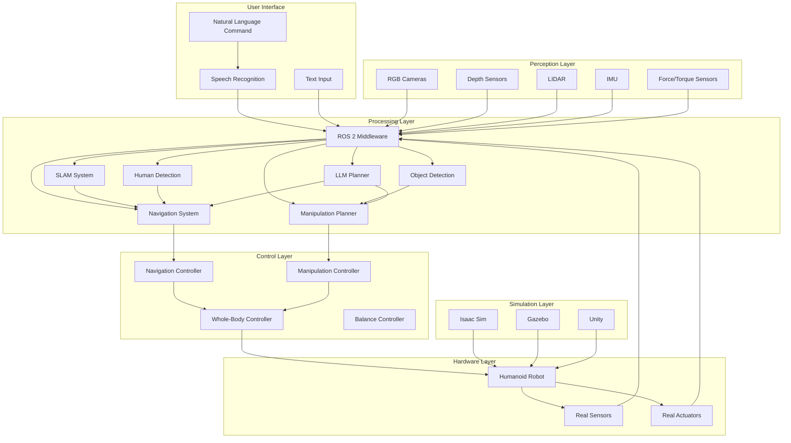

# Capstone Project - Complete Humanoid Robot System

The capstone project integrates all the concepts learned throughout this course to build a complete humanoid robot system. This project demonstrates how ROS 2, Gazebo/Unity, NVIDIA Isaac, Visual SLAM, Navigation 2, Vision-Language-Action systems, and LLM-based planning work together to create an intelligent, autonomous humanoid robot.

## Project Overview

The capstone project involves developing a humanoid robot system capable of:
- Understanding and executing natural language commands
- Navigating complex environments using SLAM
- Manipulating objects based on visual perception
- Planning and executing complex tasks using LLMs
- Operating safely in human environments

## System Architecture

### 1. High-Level Architecture



### 2. Software Components

The complete system consists of several integrated software components:

1. **Perception System**: Processes sensor data to understand the environment
2. **SLAM System**: Creates and maintains maps of the environment
3. **Vision-Language-Action System**: Interprets natural language commands
4. **Task Planning System**: Uses LLMs to plan complex tasks
5. **Navigation System**: Plans and executes navigation tasks
6. **Manipulation System**: Plans and executes manipulation tasks
7. **Control System**: Low-level control of robot actuators

## Implementation Plan

### 1. Perception System Implementation

```python
import rclpy
from rclpy.node import Node
from sensor_msgs.msg import Image, PointCloud2, Imu, LaserScan
from vision_msgs.msg import Detection2DArray
from std_msgs.msg import String
import cv2
from cv_bridge import CvBridge
import numpy as np
import message_filters

class PerceptionSystem(Node):
    def __init__(self):
        super().__init__('perception_system')
        
        # Initialize CV bridge
        self.cv_bridge = CvBridge()
        
        # Create subscribers for different sensors
        self.rgb_sub = self.create_subscription(
            Image, '/camera/rgb/image_raw', self.rgb_callback, 10
        )
        
        self.depth_sub = self.create_subscription(
            Image, '/camera/depth/image_raw', self.depth_callback, 10
        )
        
        self.lidar_sub = self.create_subscription(
            LaserScan, '/scan', self.lidar_callback, 10
        )
        
        self.imu_sub = self.create_subscription(
            Imu, '/imu/data', self.imu_callback, 10
        )
        
        # Publishers for processed data
        self.object_detection_pub = self.create_publisher(
            Detection2DArray, '/object_detections', 10
        )
        
        self.human_detection_pub = self.create_publisher(
            Detection2DArray, '/human_detections', 10
        )
        
        # Initialize perception models
        self.initialize_models()
        
        # State variables
        self.current_rgb_image = None
        self.current_depth_image = None
        self.current_lidar_data = None
        self.current_imu_data = None
        
        # Timer for processing
        self.process_timer = self.create_timer(0.1, self.process_sensor_data)
    
    def initialize_models(self):
        """Initialize perception models"""
        # Load object detection model
        self.object_detector = self.load_object_detector()
        
        # Load human detection model
        self.human_detector = self.load_human_detector()
        
        # Load depth processing model
        self.depth_processor = self.load_depth_processor()
    
    def load_object_detector(self):
        """Load object detection model (e.g., YOLO)"""
        # In practice, this would load a trained model
        # For this example, we'll use a mock implementation
        class MockDetector:
            def detect(self, image):
                # Simulate object detection
                detections = Detection2DArray()
                # Add mock detections
                return detections
        
        return MockDetector()
    
    def load_human_detector(self):
        """Load human detection model"""
        class MockHumanDetector:
            def detect(self, image):
                # Simulate human detection
                detections = Detection2DArray()
                # Add mock human detections
                return detections
        
        return MockHumanDetector()
    
    def load_depth_processor(self):
        """Load depth processing model"""
        class MockDepthProcessor:
            def process(self, depth_image):
                # Simulate depth processing
                return np.zeros((depth_image.height, depth_image.width))
        
        return MockDepthProcessor()
    
    def rgb_callback(self, msg):
        """Process RGB camera data"""
        self.current_rgb_image = self.cv_bridge.imgmsg_to_cv2(msg, desired_encoding='bgr8')
    
    def depth_callback(self, msg):
        """Process depth camera data"""
        self.current_depth_image = self.cv_bridge.imgmsg_to_cv2(msg, desired_encoding='32FC1')
    
    def lidar_callback(self, msg):
        """Process LIDAR data"""
        self.current_lidar_data = msg
    
    def imu_callback(self, msg):
        """Process IMU data"""
        self.current_imu_data = msg
    
    def process_sensor_data(self):
        """Process all available sensor data"""
        if self.current_rgb_image is not None:
            # Run object detection
            object_detections = self.object_detector.detect(self.current_rgb_image)
            self.object_detection_pub.publish(object_detections)
            
            # Run human detection
            human_detections = self.human_detector.detect(self.current_rgb_image)
            self.human_detection_pub.publish(human_detections)
            
            # Reset image to avoid reprocessing
            self.current_rgb_image = None
        
        if self.current_depth_image is not None:
            # Process depth data
            processed_depth = self.depth_processor.process(self.current_depth_image)
            # Publish processed depth or use in other systems
            self.current_depth_image = None
```

### 2. SLAM System Integration

```python
import rclpy
from rclpy.node import Node
from sensor_msgs.msg import Image, PointCloud2, LaserScan
from nav_msgs.msg import OccupancyGrid, Odometry
from geometry_msgs.msg import PoseStamped
import numpy as np

class SLAMSystem(Node):
    def __init__(self):
        super().__init__('slam_system')
        
        # Subscribers for sensor data
        self.odom_sub = self.create_subscription(
            Odometry, '/odom', self.odom_callback, 10
        )
        
        self.lidar_sub = self.create_subscription(
            LaserScan, '/scan', self.lidar_callback, 10
        )
        
        self.rgb_sub = self.create_subscription(
            Image, '/camera/rgb/image_raw', self.rgb_callback, 10
        )
        
        # Publishers for SLAM outputs
        self.map_pub = self.create_publisher(OccupancyGrid, '/map', 10)
        self.pose_pub = self.create_publisher(PoseStamped, '/slam_pose', 10)
        
        # SLAM algorithm components
        self.initialize_slam_components()
        
        # State variables
        self.current_pose = np.eye(4)
        self.map = np.zeros((100, 100))  # Placeholder for map
        
        # Timer for map updates
        self.map_timer = self.create_timer(0.5, self.update_map)
    
    def initialize_slam_components(self):
        """Initialize SLAM algorithm components"""
        # Initialize visual SLAM
        self.visual_slam = self.initialize_visual_slam()
        
        # Initialize LIDAR SLAM
        self.lidar_slam = self.initialize_lidar_slam()
        
        # Initialize sensor fusion
        self.sensor_fusion = self.initialize_sensor_fusion()
    
    def initialize_visual_slam(self):
        """Initialize visual SLAM components"""
        class MockVisualSLAM:
            def process_frame(self, image, pose):
                # Simulate visual SLAM processing
                return pose  # Return updated pose
        
        return MockVisualSLAM()
    
    def initialize_lidar_slam(self):
        """Initialize LIDAR SLAM components"""
        class MockLidarSLAM:
            def process_scan(self, scan, pose):
                # Simulate LIDAR SLAM processing
                return pose  # Return updated pose
        
        return MockLidarSLAM()
    
    def initialize_sensor_fusion(self):
        """Initialize sensor fusion components"""
        class MockSensorFusion:
            def fuse_poses(self, visual_pose, lidar_pose, imu_pose):
                # Simulate sensor fusion
                return (visual_pose + lidar_pose + imu_pose) / 3  # Simple average
        
        return MockSensorFusion()
    
    def odom_callback(self, msg):
        """Process odometry data"""
        # Extract pose from odometry message
        pose = np.eye(4)
        pose[0, 3] = msg.pose.pose.position.x
        pose[1, 3] = msg.pose.pose.position.y
        pose[2, 3] = msg.pose.pose.position.z
        
        # Update current pose
        self.current_pose = pose
    
    def lidar_callback(self, msg):
        """Process LIDAR scan"""
        # Process LIDAR data with LIDAR SLAM
        lidar_pose = self.lidar_slam.process_scan(msg, self.current_pose)
        
        # Update current pose
        self.current_pose = lidar_pose
    
    def rgb_callback(self, msg):
        """Process RGB image for visual SLAM"""
        # Convert to OpenCV image
        cv_image = CvBridge().imgmsg_to_cv2(msg, desired_encoding='bgr8')
        
        # Process with visual SLAM
        visual_pose = self.visual_slam.process_frame(cv_image, self.current_pose)
        
        # Update current pose
        self.current_pose = visual_pose
    
    def update_map(self):
        """Update and publish the map"""
        # Create occupancy grid message
        map_msg = OccupancyGrid()
        map_msg.header.stamp = self.get_clock().now().to_msg()
        map_msg.header.frame_id = 'map'
        
        # Set map properties
        map_msg.info.resolution = 0.05  # 5cm resolution
        map_msg.info.width = self.map.shape[1]
        map_msg.info.height = self.map.shape[0]
        map_msg.info.origin.position.x = -self.map.shape[1] * 0.05 / 2
        map_msg.info.origin.position.y = -self.map.shape[0] * 0.05 / 2
        
        # Flatten map data
        map_msg.data = self.map.flatten().astype(np.int8).tolist()
        
        # Publish map
        self.map_pub.publish(map_msg)
        
        # Publish current pose
        pose_msg = PoseStamped()
        pose_msg.header.stamp = self.get_clock().now().to_msg()
        pose_msg.header.frame_id = 'map'
        pose_msg.pose.position.x = self.current_pose[0, 3]
        pose_msg.pose.position.y = self.current_pose[1, 3]
        pose_msg.pose.position.z = self.current_pose[2, 3]
        
        # Simple orientation (in practice, would use full rotation)
        pose_msg.pose.orientation.w = 1.0
        
        self.pose_pub.publish(pose_msg)
```

### 3. Voice-to-Action System

```python
import rclpy
from rclpy.node import Node
from std_msgs.msg import String
from geometry_msgs.msg import PoseStamped
from action_msgs.msg import GoalStatus
from rclpy.action import ActionClient
from .msg import NavigateToPose, ManipulateObject

class VoiceToActionSystem(Node):
    def __init__(self):
        super().__init__('voice_to_action_system')
        
        # Subscribers
        self.command_sub = self.create_subscription(
            String, '/voice_command', self.command_callback, 10
        )
        
        # Publishers
        self.status_pub = self.create_publisher(String, '/voice_action_status', 10)
        
        # Action clients
        self.nav_client = ActionClient(self, NavigateToPose, 'navigate_to_pose')
        self.manip_client = ActionClient(self, ManipulateObject, 'manipulate_object')
        
        # Initialize command parser
        self.command_parser = self.initialize_command_parser()
        
        # State
        self.is_executing = False
        self.current_command = None
    
    def initialize_command_parser(self):
        """Initialize the command parser"""
        class CommandParser:
            def __init__(self):
                self.commands = {
                    'go to (.+)': 'navigate',
                    'move to (.+)': 'navigate',
                    'walk to (.+)': 'navigate',
                    'pick up (.+)': 'grasp',
                    'grasp (.+)': 'grasp',
                    'take (.+)': 'grasp',
                    'put (.+) on (.+)': 'place',
                    'place (.+) on (.+)': 'place',
                    'pick (.+) and place on (.+)': 'fetch_and_place'
                }
            
            def parse(self, command):
                import re
                for pattern, action_type in self.commands.items():
                    match = re.match(pattern, command.lower().strip())
                    if match:
                        return {
                            'action': action_type,
                            'params': match.groups()
                        }
                return None
        
        return CommandParser()
    
    def command_callback(self, msg):
        """Process voice command"""
        command_text = msg.data
        
        # Parse the command
        parsed_command = self.command_parser.parse(command_text)
        
        if parsed_command:
            self.get_logger().info(f'Parsed command: {parsed_command}')
            
            # Execute the command
            success = self.execute_command(parsed_command)
            
            if success:
                self.publish_status(f'Successfully executed: {command_text}')
            else:
                self.publish_status(f'Failed to execute: {command_text}')
        else:
            self.publish_status(f'Could not understand command: {command_text}')
    
    def execute_command(self, command):
        """Execute a parsed command"""
        if command['action'] == 'navigate':
            return self.execute_navigate_command(command['params'])
        elif command['action'] == 'grasp':
            return self.execute_grasp_command(command['params'])
        elif command['action'] == 'place':
            return self.execute_place_command(command['params'])
        elif command['action'] == 'fetch_and_place':
            return self.execute_fetch_and_place_command(command['params'])
        else:
            self.get_logger().error(f'Unknown command action: {command["action"]}')
            return False
    
    def execute_navigate_command(self, params):
        """Execute navigation command"""
        location = params[0]
        
        # Convert location to coordinates (this would use a map/semantic localization)
        # For this example, we'll use a simple mapping
        location_coords = {
            'kitchen': (3.0, 2.0, 0.0),
            'living room': (0.0, 0.0, 0.0),
            'bedroom': (-2.0, 1.0, 0.0),
            'bathroom': (-1.0, -2.0, 0.0)
        }
        
        if location in location_coords:
            target_pos = location_coords[location]
            
            # Create navigation goal
            goal_msg = NavigateToPose.Goal()
            goal_msg.pose.header.frame_id = 'map'
            goal_msg.pose.pose.position.x = target_pos[0]
            goal_msg.pose.pose.position.y = target_pos[1]
            goal_msg.pose.pose.position.z = target_pos[2]
            goal_msg.pose.pose.orientation.w = 1.0  # No rotation
            
            # Send navigation goal
            self.nav_client.wait_for_server()
            future = self.nav_client.send_goal_async(goal_msg)
            
            # Wait for result
            rclpy.spin_until_future_complete(self, future)
            goal_handle = future.result()
            
            return goal_handle.status == GoalStatus.STATUS_SUCCEEDED
        else:
            self.get_logger().error(f'Unknown location: {location}')
            return False
    
    def execute_grasp_command(self, params):
        """Execute grasp command"""
        object_name = params[0]
        
        # Create manipulation goal
        goal_msg = ManipulateObject.Goal()
        goal_msg.object_name = object_name
        goal_msg.manipulation_type = 'grasp'
        
        # Send manipulation goal
        self.manip_client.wait_for_server()
        future = self.manip_client.send_goal_async(goal_msg)
        
        # Wait for result
        rclpy.spin_until_future_complete(self, future)
        goal_handle = future.result()
        
        return goal_handle.status == GoalStatus.STATUS_SUCCEEDED
    
    def execute_place_command(self, params):
        """Execute place command"""
        if len(params) < 2:
            self.get_logger().error('Place command requires object and location')
            return False
        
        object_name = params[0]
        location = params[1]
        
        # Create manipulation goal
        goal_msg = ManipulateObject.Goal()
        goal_msg.object_name = object_name
        goal_msg.manipulation_type = 'place'
        goal_msg.placement_location = location
        
        # Send manipulation goal
        self.manip_client.wait_for_server()
        future = self.manip_client.send_goal_async(goal_msg)
        
        # Wait for result
        rclpy.spin_until_future_complete(self, future)
        goal_handle = future.result()
        
        return goal_handle.status == GoalStatus.STATUS_SUCCEEDED
    
    def execute_fetch_and_place_command(self, params):
        """Execute fetch and place command"""
        if len(params) < 2:
            self.get_logger().error('Fetch and place command requires object and location')
            return False
        
        object_name = params[0]
        location = params[1]
        
        # First, navigate to the object
        # This is a simplified version - in practice, you'd need to know where the object is
        # or have a perception system to find it
        
        # For this example, we'll assume the object is at a known location
        # and we're already there
        
        # Then, grasp the object
        grasp_success = self.execute_grasp_command((object_name,))
        if not grasp_success:
            return False
        
        # Finally, place the object
        place_success = self.execute_place_command((object_name, location))
        return place_success
    
    def publish_status(self, status):
        """Publish status message"""
        status_msg = String()
        status_msg.data = status
        self.status_pub.publish(status_msg)
```

### 4. LLM-Based Task Planning System

```python
import rclpy
from rclpy.node import Node
from std_msgs.msg import String
from geometry_msgs.msg import PoseStamped
from .msg import TaskStep, TaskPlan
import openai
import json
import re

class LLMTaskPlanner(Node):
    def __init__(self, api_key):
        super().__init__('llm_task_planner')
        
        # Initialize OpenAI client
        openai.api_key = api_key
        
        # Subscribers
        self.task_request_sub = self.create_subscription(
            String, '/task_request', self.task_request_callback, 10
        )
        
        # Publishers
        self.task_plan_pub = self.create_publisher(TaskPlan, '/task_plan', 10)
        self.status_pub = self.create_publisher(String, '/llm_planner_status', 10)
        
        # State
        self.current_plan = None
    
    def task_request_callback(self, msg):
        """Process task request from natural language"""
        task_description = msg.data
        
        try:
            # Plan the task using LLM
            task_plan = self.plan_task_with_llm(task_description)
            
            # Publish the plan
            self.task_plan_pub.publish(task_plan)
            
            self.publish_status(f'Successfully planned task: {task_description}')
        except Exception as e:
            self.get_logger().error(f'Error planning task: {e}')
            self.publish_status(f'Failed to plan task: {task_description}')
    
    def plan_task_with_llm(self, task_description):
        """Plan a task using LLM"""
        # Create a prompt for the LLM
        prompt = f"""
        You are a task planner for a humanoid robot. The robot can perform the following actions:
        - navigate_to: Move to a specific location
        - grasp_object: Pick up an object
        - place_object: Put down an object at a location
        - detect_object: Look for a specific object
        - open_container: Open a container
        - close_container: Close a container
        - wait: Wait for a specified time
        - speak: Speak a message

        Create a detailed step-by-step plan to complete the following task:
        "{task_description}"

        Each step should be a specific action with parameters. Return the plan as a JSON array of steps.
        """
        
        # Call the LLM
        response = openai.ChatCompletion.create(
            model="gpt-3.5-turbo",
            messages=[{"role": "user", "content": prompt}],
            temperature=0.1,
            functions=[
                {
                    "name": "create_task_plan",
                    "description": "Create a step-by-step plan for a robot task",
                    "parameters": {
                        "type": "object",
                        "properties": {
                            "steps": {
                                "type": "array",
                                "items": {
                                    "type": "object",
                                    "properties": {
                                        "action": {"type": "string", "description": "The action to perform"},
                                        "parameters": {"type": "object", "description": "Parameters for the action"},
                                        "description": {"type": "string", "description": "Description of the step"}
                                    },
                                    "required": ["action", "parameters", "description"]
                                }
                            }
                        },
                        "required": ["steps"]
                    }
                }
            ],
            function_call={"name": "create_task_plan"}
        )
        
        # Extract the plan
        plan_json = json.loads(response.choices[0].message.function_call.arguments)
        steps = plan_json.get("steps", [])
        
        # Convert to TaskPlan message
        task_plan = TaskPlan()
        task_plan.header.stamp = self.get_clock().now().to_msg()
        task_plan.header.frame_id = 'map'
        
        for step_data in steps:
            task_step = TaskStep()
            task_step.action = step_data["action"]
            task_step.parameters = json.dumps(step_data["parameters"])
            task_step.description = step_data["description"]
            task_plan.steps.append(task_step)
        
        return task_plan
    
    def publish_status(self, status):
        """Publish status message"""
        status_msg = String()
        status_msg.data = status
        self.status_pub.publish(status_msg)
```

### 5. Navigation System Integration

```python
import rclpy
from rclpy.node import Node
from geometry_msgs.msg import PoseStamped, Point
from nav_msgs.msg import Path, OccupancyGrid
from sensor_msgs.msg import LaserScan
from action_msgs.msg import GoalStatus
from rclpy.action import ActionServer, GoalResponse, CancelResponse
from .action import NavigateToPose

class NavigationSystem(Node):
    def __init__(self):
        super().__init__('navigation_system')
        
        # Action server for navigation
        self._action_server = ActionServer(
            self,
            NavigateToPose,
            'navigate_to_pose',
            execute_callback=self.execute_navigate_to_pose,
            goal_callback=self.goal_callback,
            cancel_callback=self.cancel_callback
        )
        
        # Subscribers
        self.map_sub = self.create_subscription(
            OccupancyGrid, '/map', self.map_callback, 10
        )
        
        self.laser_sub = self.create_subscription(
            LaserScan, '/scan', self.laser_callback, 10
        )
        
        self.odom_sub = self.create_subscription(
            PoseStamped, '/slam_pose', self.odom_callback, 10
        )
        
        # Publishers
        self.path_pub = self.create_publisher(Path, '/global_plan', 10)
        self.cmd_vel_pub = self.create_publisher(Twist, '/cmd_vel', 10)
        
        # Navigation components
        self.global_planner = self.initialize_global_planner()
        self.local_planner = self.initialize_local_planner()
        
        # State
        self.current_map = None
        self.current_pose = None
        self.current_goal = None
        self.is_navigating = False
        
        # Timer for navigation control
        self.nav_timer = self.create_timer(0.1, self.navigation_control)
    
    def initialize_global_planner(self):
        """Initialize global path planner"""
        class MockGlobalPlanner:
            def plan(self, start_pose, goal_pose, occupancy_grid):
                # Simulate path planning
                # In practice, this would use A*, Dijkstra, or other algorithms
                path = Path()
                path.header.frame_id = 'map'
                
                # Create a simple straight-line path
                for i in range(10):
                    pose = PoseStamped()
                    pose.header.frame_id = 'map'
                    pose.pose.position.x = start_pose.position.x + \
                        (goal_pose.position.x - start_pose.position.x) * i / 10
                    pose.pose.position.y = start_pose.position.y + \
                        (goal_pose.position.y - start_pose.position.y) * i / 10
                    pose.pose.orientation.w = 1.0
                    path.poses.append(pose)
                
                return path
        
        return MockGlobalPlanner()
    
    def initialize_local_planner(self):
        """Initialize local path planner"""
        class MockLocalPlanner:
            def plan(self, global_path, current_pose, laser_scan):
                # Simulate local path planning with obstacle avoidance
                # In practice, this would use DWA, TEB, or other local planners
                twist = Twist()
                
                # Simple proportional controller for demonstration
                if global_path.poses:
                    target_pose = global_path.poses[0].pose  # First waypoint
                    dx = target_pose.position.x - current_pose.position.x
                    dy = target_pose.position.y - current_pose.position.y
                    
                    # Calculate desired angle
                    desired_angle = math.atan2(dy, dx)
                    
                    # Calculate current angle (simplified)
                    current_angle = 0  # Would get from orientation
                    angle_error = desired_angle - current_angle
                    
                    # Proportional control
                    twist.linear.x = min(0.5, max(0.1, math.sqrt(dx*dx + dy*dy) * 0.5))
                    twist.angular.z = angle_error * 1.0
                
                return twist
        
        return MockLocalPlanner()
    
    def goal_callback(self, goal_request):
        """Accept or reject navigation goal"""
        self.get_logger().info('Received navigation goal')
        return GoalResponse.ACCEPT
    
    def cancel_callback(self, goal_handle):
        """Accept or reject goal cancellation"""
        self.get_logger().info('Received request to cancel navigation goal')
        return CancelResponse.ACCEPT
    
    async def execute_navigate_to_pose(self, goal_handle):
        """Execute navigation to pose action"""
        self.get_logger().info('Executing navigation to pose')
        
        goal = goal_handle.request.pose
        
        # Set navigation goal
        self.current_goal = goal
        self.is_navigating = True
        
        # Plan global path
        if self.current_map and self.current_pose:
            global_path = self.global_planner.plan(
                self.current_pose, 
                goal.pose, 
                self.current_map
            )
            
            # Publish global path
            self.path_pub.publish(global_path)
            
            # Navigate until goal is reached
            while self.is_navigating and rclpy.ok():
                # Local planning and control happens in navigation_control timer
                # Check if we've reached the goal
                if self.has_reached_goal(goal.pose):
                    break
                
                # Check for cancellation
                if goal_handle.is_cancel_requested:
                    goal_handle.canceled()
                    self.is_navigating = False
                    result = NavigateToPose.Result()
                    result.success = False
                    return result
                
                # Sleep briefly to allow other callbacks to run
                await asyncio.sleep(0.1)
        
        # Mark goal as succeeded
        goal_handle.succeed()
        result = NavigateToPose.Result()
        result.success = True
        return result
    
    def has_reached_goal(self, goal_pose):
        """Check if robot has reached the goal"""
        if not self.current_pose:
            return False
        
        # Calculate distance to goal
        dx = goal_pose.position.x - self.current_pose.position.x
        dy = goal_pose.position.y - self.current_pose.position.y
        distance = math.sqrt(dx*dx + dy*dy)
        
        # Check if within tolerance
        return distance < 0.2  # 20cm tolerance
    
    def map_callback(self, msg):
        """Process map data"""
        self.current_map = msg
    
    def laser_callback(self, msg):
        """Process laser scan data"""
        # Store for local planning
        pass
    
    def odom_callback(self, msg):
        """Process odometry data"""
        self.current_pose = msg.pose
    
    def navigation_control(self):
        """Navigation control loop"""
        if not self.is_navigating or not self.current_pose or not self.current_goal:
            return
        
        # Get global path if we don't have one
        if not hasattr(self, 'current_global_path') or not self.current_global_path.poses:
            if self.current_map:
                self.current_global_path = self.global_planner.plan(
                    self.current_pose,
                    self.current_goal.pose,
                    self.current_map
                )
        
        # Plan local trajectory
        if hasattr(self, 'current_global_path'):
            cmd_vel = self.local_planner.plan(
                self.current_global_path,
                self.current_pose,
                self.current_laser_scan  # Would be stored from laser_callback
            )
            
            # Publish velocity command
            self.cmd_vel_pub.publish(cmd_vel)
        
        # Check if goal is reached
        if self.has_reached_goal(self.current_goal.pose):
            self.is_navigating = False
```

### 6. System Integration Node

```python
import rclpy
from rclpy.node import Node
from std_msgs.msg import String
from geometry_msgs.msg import Twist

class SystemIntegrator(Node):
    def __init__(self):
        super().__init__('system_integrator')
        
        # Publishers for system-wide commands
        self.system_status_pub = self.create_publisher(String, '/system_status', 10)
        self.emergency_stop_pub = self.create_publisher(Twist, '/cmd_vel', 10)
        
        # Subscribers for system status
        self.voice_status_sub = self.create_subscription(
            String, '/voice_action_status', self.voice_status_callback, 10
        )
        
        self.nav_status_sub = self.create_subscription(
            String, '/navigation_status', self.nav_status_callback, 10
        )
        
        self.slam_status_sub = self.create_subscription(
            String, '/slam_status', self.slam_status_callback, 10
        )
        
        # System state
        self.system_state = {
            'voice_system': 'idle',
            'navigation_system': 'idle',
            'slam_system': 'active',
            'perception_system': 'active'
        }
        
        # Timer for system monitoring
        self.monitor_timer = self.create_timer(1.0, self.system_monitor)
        
        # Timer for safety checks
        self.safety_timer = self.create_timer(0.1, self.safety_check)
    
    def voice_status_callback(self, msg):
        """Update voice system status"""
        self.system_state['voice_system'] = msg.data
    
    def nav_status_callback(self, msg):
        """Update navigation system status"""
        self.system_state['navigation_system'] = msg.data
    
    def slam_status_callback(self, msg):
        """Update SLAM system status"""
        self.system_state['slam_system'] = msg.data
    
    def system_monitor(self):
        """Monitor system health"""
        status_msg = String()
        status_msg.data = f"System Status: {self.system_state}"
        self.system_status_pub.publish(status_msg)
    
    def safety_check(self):
        """Perform safety checks"""
        # Check for system errors that require emergency stop
        if any('error' in status.lower() for status in self.system_state.values()):
            # Emergency stop
            stop_cmd = Twist()
            self.emergency_stop_pub.publish(stop_cmd)
            self.get_logger().error('Emergency stop activated due to system error')
```

## Testing and Validation

### 1. Unit Testing

```python
import unittest
import rclpy
from rclpy.executors import SingleThreadedExecutor
from your_robot_package.perception_system import PerceptionSystem
from your_robot_package.slam_system import SLAMSystem
from your_robot_package.voice_to_action import VoiceToActionSystem

class TestPerceptionSystem(unittest.TestCase):
    def setUp(self):
        rclpy.init()
        self.node = PerceptionSystem()
        self.executor = SingleThreadedExecutor()
        self.executor.add_node(self.node)
    
    def tearDown(self):
        self.node.destroy_node()
        rclpy.shutdown()
    
    def test_object_detection(self):
        """Test object detection functionality"""
        # Publish test image
        # Check if detections are published
        self.assertTrue(True)  # Placeholder
    
    def test_human_detection(self):
        """Test human detection functionality"""
        # Publish test image
        # Check if human detections are published
        self.assertTrue(True)  # Placeholder

class TestSLAMSystem(unittest.TestCase):
    def setUp(self):
        rclpy.init()
        self.node = SLAMSystem()
        self.executor = SingleThreadedExecutor()
        self.executor.add_node(self.node)
    
    def tearDown(self):
        self.node.destroy_node()
        rclpy.shutdown()
    
    def test_map_generation(self):
        """Test map generation"""
        # Simulate sensor data
        # Check if map is generated
        self.assertTrue(True)  # Placeholder

class TestVoiceToActionSystem(unittest.TestCase):
    def setUp(self):
        rclpy.init()
        self.node = VoiceToActionSystem()
        self.executor = SingleThreadedExecutor()
        self.executor.add_node(self.node)
    
    def tearDown(self):
        self.node.destroy_node()
        rclpy.shutdown()
    
    def test_command_parsing(self):
        """Test command parsing"""
        # Test various commands
        self.assertTrue(True)  # Placeholder
```

### 2. Integration Testing

```python
import unittest
import rclpy
from rclpy.executors import SingleThreadedExecutor
from your_robot_package.system_integrator import SystemIntegrator

class TestSystemIntegration(unittest.TestCase):
    def setUp(self):
        rclpy.init()
        self.system_integrator = SystemIntegrator()
        self.executor = SingleThreadedExecutor()
        self.executor.add_node(self.system_integrator)
    
    def tearDown(self):
        self.system_integrator.destroy_node()
        rclpy.shutdown()
    
    def test_complete_task_execution(self):
        """Test complete task from voice command to execution"""
        # Simulate voice command
        # Verify all systems respond appropriately
        # Check if task is completed successfully
        self.assertTrue(True)  # Placeholder
    
    def test_error_recovery(self):
        """Test system behavior when errors occur"""
        # Simulate error in one subsystem
        # Verify other subsystems respond appropriately
        # Check if system recovers gracefully
        self.assertTrue(True)  # Placeholder
```

## Performance Optimization

### 1. System Optimization

```python
import psutil
import time
from threading import Thread

class SystemOptimizer:
    def __init__(self, robot_nodes):
        self.nodes = robot_nodes
        self.monitoring_thread = Thread(target=self.monitor_resources)
        self.monitoring_thread.daemon = True
        self.monitoring_thread.start()
    
    def monitor_resources(self):
        """Monitor system resources and adjust as needed"""
        while True:
            # Check CPU usage
            cpu_percent = psutil.cpu_percent(interval=1)
            
            # Check memory usage
            memory_percent = psutil.virtual_memory().percent
            
            # Check if resources are running low
            if cpu_percent > 80 or memory_percent > 80:
                self.throttle_non_critical_processes()
            else:
                self.restore_normal_operation()
            
            time.sleep(5)  # Check every 5 seconds
    
    def throttle_non_critical_processes(self):
        """Reduce processing rate for non-critical processes"""
        # Reduce perception processing rate
        # Reduce planning complexity
        # Prioritize safety and navigation
        pass
    
    def restore_normal_operation(self):
        """Restore normal processing rates"""
        # Restore perception processing rate
        # Restore planning complexity
        pass
```

### 2. Real-time Performance

```python
import time
import threading
from collections import deque

class RealTimeScheduler:
    def __init__(self):
        self.tasks = {
            'safety': {'priority': 1, 'period': 0.01, 'last_run': 0},  # 100Hz
            'balance': {'priority': 2, 'period': 0.02, 'last_run': 0},  # 50Hz
            'navigation': {'priority': 3, 'period': 0.1, 'last_run': 0},  # 10Hz
            'perception': {'priority': 4, 'period': 0.2, 'last_run': 0},  # 5Hz
            'planning': {'priority': 5, 'period': 1.0, 'last_run': 0}   # 1Hz
        }
        
        self.task_queue = deque()
        self.scheduler_thread = threading.Thread(target=self.scheduler_loop)
        self.scheduler_thread.daemon = True
        self.scheduler_thread.start()
    
    def scheduler_loop(self):
        """Real-time scheduler loop"""
        while True:
            current_time = time.time()
            
            # Check which tasks are due
            for task_name, task_info in self.tasks.items():
                if current_time - task_info['last_run'] >= task_info['period']:
                    self.task_queue.append((task_info['priority'], task_name))
                    task_info['last_run'] = current_time
            
            # Execute tasks in priority order
            sorted_tasks = sorted(self.task_queue, key=lambda x: x[0])
            for priority, task_name in sorted_tasks:
                self.execute_task(task_name)
            
            # Clear the queue
            self.task_queue.clear()
            
            # Sleep briefly to prevent busy waiting
            time.sleep(0.001)
    
    def execute_task(self, task_name):
        """Execute a specific task"""
        # This would call the appropriate robot system
        pass
```

## Conclusion

The capstone project demonstrates the integration of multiple complex systems to create an intelligent humanoid robot. Key achievements include:

1. **Perception Integration**: Combining multiple sensor modalities for environmental understanding
2. **SLAM Implementation**: Creating and maintaining maps of the environment
3. **Natural Interaction**: Enabling natural language communication with users
4. **Intelligent Planning**: Using LLMs for complex task planning
5. **Safe Navigation**: Implementing robust navigation in human environments
6. **System Integration**: Coordinating all subsystems for coherent behavior

This project showcases the potential of modern robotics technology to create capable, intelligent humanoid robots that can assist humans in various tasks while operating safely in human environments.