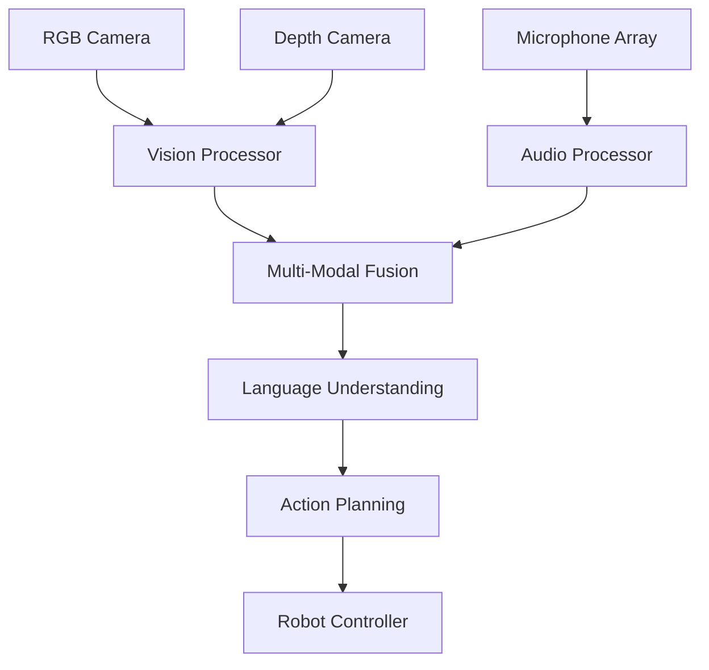

# Introduction to Vision-Language-Action Systems

Vision-Language-Action (VLA) systems represent the next frontier in robotics, where robots can perceive their environment through vision, understand human instructions through language, and execute complex actions to achieve goals. This integration enables robots to operate in human environments with unprecedented flexibility and adaptability.

## Understanding Vision-Language-Action Systems

VLA systems combine three critical capabilities:

1. **Vision**: Perceiving and understanding the visual world
2. **Language**: Processing and generating natural language
3. **Action**: Executing physical or digital tasks

For humanoid robots, VLA systems are particularly important as they enable natural human-robot interaction in everyday environments.

## The VLA Framework

### 1. Vision Component

The vision component processes visual information from cameras and sensors:

- Object detection and recognition
- Scene understanding
- Depth estimation
- Motion tracking
- Visual SLAM for navigation

### 2. Language Component

The language component handles natural language processing:

- Speech recognition
- Natural language understanding
- Dialogue management
- Instruction parsing
- Contextual reasoning

### 3. Action Component

The action component executes physical or digital tasks:

- Motion planning
- Manipulation control
- Navigation
- Task execution
- Safety monitoring

## Integration Challenges

### 1. Multi-Modal Fusion

Combining information from different modalities:

- Aligning visual and linguistic representations
- Handling temporal inconsistencies
- Managing uncertainty across modalities
- Creating unified world models

### 2. Real-Time Processing

Processing all components in real-time:

- Optimizing computational efficiency
- Managing resource allocation
- Handling sensor fusion delays
- Ensuring responsive interaction

### 3. Safety and Reliability

Ensuring safe operation:

- Fail-safe mechanisms
- Uncertainty quantification
- Human-aware navigation
- Collision avoidance

## Applications in Humanoid Robotics

### 1. Domestic Assistance

Humanoid robots with VLA capabilities can:
- Follow verbal instructions to perform household tasks
- Recognize and manipulate objects in home environments
- Interact naturally with family members
- Learn new tasks through demonstration

### 2. Healthcare Support

In healthcare settings:
- Assisting elderly or disabled individuals
- Following medical staff instructions
- Recognizing medical equipment and supplies
- Providing companionship and monitoring

### 3. Educational Support

In educational environments:
- Interacting with students of different ages
- Demonstrating concepts through physical actions
- Answering questions and providing explanations
- Adapting to different learning styles

## Technical Architecture

### 1. Sensor Integration

VLA systems require multiple sensors:

### 2. Processing Pipeline

The typical VLA processing pipeline:

1. **Perception**: Process sensor data to extract meaningful features
2. **Fusion**: Combine information from multiple modalities
3. **Understanding**: Interpret the fused information in context
4. **Planning**: Generate action sequences to achieve goals
5. **Execution**: Execute actions while monitoring for safety
6. **Learning**: Update models based on experience

## Deep Learning in VLA Systems

### 1. Vision Transformers

Vision Transformers (ViTs) have revolutionized visual processing:

- Self-attention mechanisms for global context
- Scalable architectures for complex scenes
- Transfer learning capabilities
- Integration with language models

### 2. Large Language Models

LLMs provide powerful language understanding:

- Contextual language understanding
- Reasoning capabilities
- Instruction following
- Multi-turn dialogue management

### 3. Vision-Language Models

Models that jointly process vision and language:

- CLIP (Contrastive Language-Image Pretraining)
- BLIP (Bootstrapping Language-Image Pretraining)
- Flamingo and other multimodal models
- Instruction-tuned vision-language models

## VLA in Real-World Applications

### 1. Object Manipulation

VLA systems enable robots to:
- Understand verbal instructions for manipulation tasks
- Recognize objects in cluttered environments
- Plan grasps based on object properties
- Execute precise manipulation actions

### 2. Navigation and Mobility

For humanoid navigation:
- Understanding spatial language ("go to the kitchen")
- Recognizing landmarks and destinations
- Planning paths through human environments
- Avoiding obstacles while following instructions

### 3. Social Interaction

Humanoid robots with VLA can:
- Recognize human emotions and expressions
- Respond appropriately to social cues
- Maintain natural conversations
- Adapt behavior based on context

## Challenges and Future Directions

### 1. Technical Challenges

Current challenges in VLA systems:

- Computational requirements for real-time processing
- Integration of heterogeneous models
- Handling ambiguity in natural language
- Generalization to novel situations

### 2. Ethical Considerations

Important ethical aspects:

- Privacy preservation in visual processing
- Bias mitigation in language models
- Transparency in decision-making
- Human oversight and control

### 3. Future Developments

Emerging trends in VLA:

- Foundation models for robotics
- Continual learning and adaptation
- Improved safety mechanisms
- Better human-robot collaboration

## Implementing VLA Systems

### 1. Software Architecture

A typical VLA software stack includes:

- Perception layer (vision, audio, sensors)
- Fusion and understanding layer
- Planning and reasoning layer
- Execution and control layer
- Human interface layer

### 2. Hardware Requirements

VLA systems need specialized hardware:

- Powerful GPUs for deep learning inference
- Multiple cameras for visual perception
- Microphone arrays for speech recognition
- High-bandwidth communication systems

## VLA and Humanoid Robotics Integration

The integration of VLA with humanoid robotics creates opportunities for:

- Natural human-robot interaction
- Flexible task execution
- Learning from human demonstration
- Safe operation in human environments

VLA systems represent a significant advancement in robotics, enabling robots to interact with humans in natural, intuitive ways while performing complex physical tasks. For humanoid robots, these capabilities are essential for operating effectively in human-centric environments.