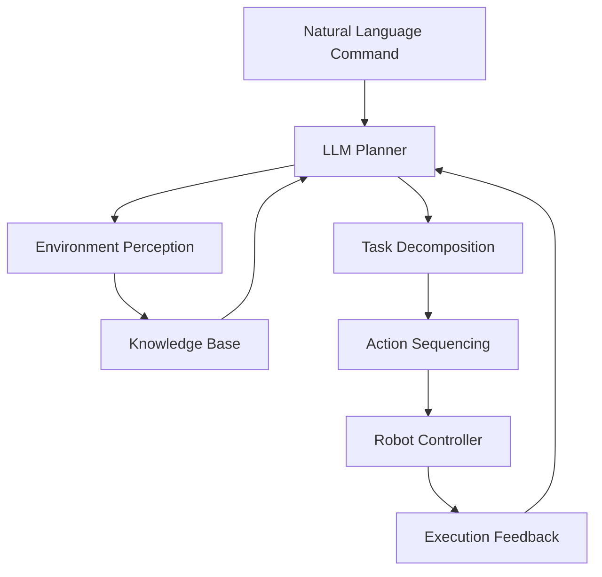

# LLM-Based Task Planning for Humanoid Robots

Large Language Models (LLMs) have revolutionized the field of artificial intelligence, offering unprecedented capabilities in natural language understanding and reasoning. When applied to humanoid robotics, LLMs can significantly enhance task planning capabilities, enabling robots to interpret complex instructions, reason about their environment, and generate sophisticated action sequences.

## Introduction to LLMs in Robotics

### What are Large Language Models?

Large Language Models are neural networks trained on vast amounts of text data to understand and generate human-like language. These models, such as GPT, Claude, and others, demonstrate remarkable abilities in:

- Natural language understanding
- Logical reasoning
- Knowledge retrieval
- Instruction following
- Contextual adaptation

### LLMs in Robotics Context

In robotics, LLMs serve as high-level cognitive processors that can:

- Interpret complex natural language commands
- Plan multi-step tasks
- Reason about affordances and constraints
- Generate executable action sequences
- Handle ambiguous or incomplete instructions

## Architecture for LLM-Based Planning

### 1. Integration Architecture



### 2. Planning Pipeline

The LLM-based planning pipeline consists of several key components:

1. **Input Processing**: Interpreting natural language commands
2. **World Modeling**: Creating a representation of the environment
3. **Task Decomposition**: Breaking down complex tasks into subtasks
4. **Action Sequencing**: Generating executable action sequences
5. **Execution Monitoring**: Tracking execution and adapting to changes

## Implementing LLM-Based Task Planning

### 1. Environment Perception Interface

```python
import json
from dataclasses import dataclass
from typing import List, Dict, Any, Optional
from enum import Enum

class ObjectType(Enum):
    FURNITURE = "furniture"
    MANIPULABLE = "manipulable"
    SURFACE = "surface"
    PERSON = "person"

@dataclass
class ObjectInfo:
    name: str
    object_type: ObjectType
    position: Dict[str, float]
    properties: Dict[str, Any]

@dataclass
class EnvironmentState:
    objects: List[ObjectInfo]
    robot_position: Dict[str, float]
    robot_state: Dict[str, Any]

class EnvironmentPerceptor:
    def __init__(self):
        self.current_state = EnvironmentState(
            objects=[],
            robot_position={"x": 0.0, "y": 0.0, "z": 0.0},
            robot_state={}
        )
    
    def get_current_state(self) -> EnvironmentState:
        """Get current environment state from perception systems"""
        # This would interface with actual perception systems
        # For simulation, return mock data
        return self.current_state
    
    def update_state(self, new_objects: List[ObjectInfo]):
        """Update environment state with new object information"""
        self.current_state.objects = new_objects
    
    def find_object_by_name(self, name: str) -> Optional[ObjectInfo]:
        """Find an object by its name"""
        for obj in self.current_state.objects:
            if obj.name.lower() == name.lower():
                return obj
        return None
    
    def find_objects_by_type(self, obj_type: ObjectType) -> List[ObjectInfo]:
        """Find all objects of a specific type"""
        return [obj for obj in self.current_state.objects if obj.object_type == obj_type]
```

### 2. LLM Planner Implementation

```python
import openai
import json
import re
from typing import List, Dict, Any
from dataclasses import dataclass

@dataclass
class TaskStep:
    action: str
    parameters: Dict[str, Any]
    description: str

class LLMTaskPlanner:
    def __init__(self, api_key: str, model: str = "gpt-3.5-turbo"):
        openai.api_key = api_key
        self.model = model
        self.environment_perceptor = EnvironmentPerceptor()
    
    def plan_task(self, natural_language_goal: str, environment_state: EnvironmentState) -> List[TaskStep]:
        """Plan a task based on natural language goal and environment state"""
        
        # Create a prompt for the LLM
        prompt = self._create_planning_prompt(natural_language_goal, environment_state)
        
        # Call the LLM
        response = openai.ChatCompletion.create(
            model=self.model,
            messages=[
                {"role": "system", "content": self._get_system_prompt()},
                {"role": "user", "content": prompt}
            ],
            temperature=0.1,  # Low temperature for consistency
            functions=[
                {
                    "name": "create_task_plan",
                    "description": "Create a plan for executing a robot task",
                    "parameters": {
                        "type": "object",
                        "properties": {
                            "steps": {
                                "type": "array",
                                "items": {
                                    "type": "object",
                                    "properties": {
                                        "action": {"type": "string", "description": "The action to perform"},
                                        "parameters": {"type": "object", "description": "Parameters for the action"},
                                        "description": {"type": "string", "description": "Description of the step"}
                                    },
                                    "required": ["action", "parameters", "description"]
                                }
                            }
                        },
                        "required": ["steps"]
                    }
                }
            ],
            function_call={"name": "create_task_plan"}
        )
        
        # Extract the plan from the response
        plan_json = json.loads(response.choices[0].message.function_call.arguments)
        steps = plan_json.get("steps", [])
        
        # Convert to TaskStep objects
        task_steps = []
        for step_data in steps:
            task_step = TaskStep(
                action=step_data["action"],
                parameters=step_data["parameters"],
                description=step_data["description"]
            )
            task_steps.append(task_step)
        
        return task_steps
    
    def _create_planning_prompt(self, goal: str, env_state: EnvironmentState) -> str:
        """Create a prompt for the LLM with environment context"""
        objects_list = []
        for obj in env_state.objects:
            obj_desc = f"- {obj.name} ({obj.object_type.value}) at position {obj.position}"
            if obj.properties:
                obj_desc += f" with properties: {obj.properties}"
            objects_list.append(obj_desc)
        
        prompt = f"""
Goal: {goal}

Current Environment:
Robot Position: {env_state.robot_position}
Available Objects:
{chr(10).join(objects_list)}

Please create a step-by-step plan to achieve this goal. Consider the available objects and their properties.
"""
        return prompt
    
    def _get_system_prompt(self) -> str:
        """Get the system prompt for the LLM"""
        return """
You are a helpful assistant that creates detailed task plans for a humanoid robot. 
The robot can perform actions like:
- navigate_to: Move to a specific location
- grasp_object: Pick up an object
- place_object: Put down an object at a location
- open_container: Open a container
- close_container: Close a container
- detect_object: Look for a specific object
- follow_person: Follow a person
- wait: Wait for a specified time

Create a sequence of these actions to achieve the user's goal. 
Consider the robot's current environment and available objects.
Each step should be specific and executable.
"""
```

### 3. Knowledge Base Integration

```python
import json
from typing import Dict, List, Any

class KnowledgeBase:
    def __init__(self, knowledge_file: str = None):
        if knowledge_file:
            with open(knowledge_file, 'r') as f:
                self.knowledge = json.load(f)
        else:
            # Default knowledge for humanoid robots
            self.knowledge = {
                "object_affordances": {
                    "cup": ["grasp", "carry", "place"],
                    "book": ["grasp", "carry", "place", "open"],
                    "box": ["grasp", "carry", "place", "open", "close"],
                    "door": ["open", "close", "navigate_through"],
                    "chair": ["navigate_to", "move_around"],
                    "table": ["navigate_to", "place_on"],
                    "kitchen_counter": ["navigate_to", "place_on"]
                },
                "locations": {
                    "kitchen": {
                        "objects": ["cup", "plate", "fridge", "kitchen_counter"],
                        "actions": ["navigate_to", "grasp_object", "place_object"]
                    },
                    "living_room": {
                        "objects": ["sofa", "coffee_table", "tv"],
                        "actions": ["navigate_to", "grasp_object", "place_object"]
                    },
                    "bedroom": {
                        "objects": ["bed", "nightstand", "wardrobe"],
                        "actions": ["navigate_to", "grasp_object", "place_object"]
                    }
                },
                "task_templates": {
                    "fetch_object": [
                        {"action": "navigate_to", "params": {"location": "{location}"}},
                        {"action": "detect_object", "params": {"object": "{object}"}},
                        {"action": "grasp_object", "params": {"object": "{object}"}},
                        {"action": "navigate_to", "params": {"location": "{destination}"}},
                        {"action": "place_object", "params": {"object": "{object}", "location": "{destination}"}}
                    ]
                }
            }
    
    def get_affordances(self, object_type: str) -> List[str]:
        """Get possible actions for an object type"""
        return self.knowledge["object_affordances"].get(object_type, [])
    
    def get_location_info(self, location: str) -> Dict[str, Any]:
        """Get information about a location"""
        return self.knowledge["locations"].get(location, {})
    
    def get_task_template(self, task_type: str) -> List[Dict[str, Any]]:
        """Get a template for a specific task type"""
        return self.knowledge["task_templates"].get(task_type, [])
    
    def update_knowledge(self, new_knowledge: Dict[str, Any]):
        """Update the knowledge base with new information"""
        self.knowledge.update(new_knowledge)
```

### 4. Advanced Planning with Context

```python
class ContextAwarePlanner:
    def __init__(self):
        self.knowledge_base = KnowledgeBase()
        self.environment_perceptor = EnvironmentPerceptor()
        self.llm_planner = LLMTaskPlanner(api_key="your-api-key")
        
        # Context tracking
        self.context_history = []
        self.current_task = None
        self.task_history = []
    
    def plan_with_context(self, goal: str, user_context: Dict[str, Any] = None) -> List[TaskStep]:
        """Plan a task considering context and history"""
        # Get current environment state
        env_state = self.environment_perceptor.get_current_state()
        
        # Augment the goal with context
        contextualized_goal = self._augment_goal_with_context(goal, user_context, env_state)
        
        # Plan the task
        task_steps = self.llm_planner.plan_task(contextualized_goal, env_state)
        
        # Update context
        self.context_history.append({
            "goal": goal,
            "context": user_context,
            "environment": env_state,
            "plan": task_steps
        })
        
        return task_steps
    
    def _augment_goal_with_context(self, goal: str, user_context: Dict[str, Any], env_state: EnvironmentState) -> str:
        """Augment the goal with relevant context information"""
        context_parts = []
        
        # Add user preferences if available
        if user_context:
            if user_context.get("preferred_hand", "right") == "left":
                context_parts.append("The user prefers using the left hand for manipulation.")
            
            if "allergies" in user_context:
                context_parts.append(f"The user has allergies to: {', '.join(user_context['allergies'])}")
        
        # Add temporal context
        import datetime
        current_time = datetime.datetime.now()
        time_context = f"Current time is {current_time.strftime('%H:%M')}. "
        if 6 <= current_time.hour < 12:
            time_context += "It's morning, so be mindful of quiet activities."
        elif 12 <= current_time.hour < 18:
            time_context += "It's daytime, normal activity level is acceptable."
        elif 18 <= current_time.hour < 22:
            time_context += "It's evening, consider dimming lights if appropriate."
        else:
            time_context += "It's nighttime, be extra careful with noise."
        
        context_parts.append(time_context)
        
        # Add environment context
        if env_state.robot_state.get("battery_level", 100) < 20:
            context_parts.append("Robot battery is low, prioritize efficient paths.")
        
        # Combine goal with context
        full_context = " ".join(context_parts)
        if full_context:
            return f"{full_context} Goal: {goal}"
        else:
            return goal
    
    def adapt_plan_to_feedback(self, original_plan: List[TaskStep], feedback: Dict[str, Any]) -> List[TaskStep]:
        """Adapt the plan based on execution feedback"""
        # Handle different types of feedback
        if feedback.get("action_failed"):
            failed_step_idx = feedback.get("failed_step_index", 0)
            failure_reason = feedback.get("failure_reason", "unknown")
            
            # Modify the plan to handle the failure
            new_plan = original_plan.copy()
            
            if failure_reason == "object_not_found":
                # Add a detection step before the failed grasp
                detect_step = TaskStep(
                    action="detect_object",
                    parameters={"object": original_plan[failed_step_idx].parameters.get("object")},
                    description="Detect the object before grasping"
                )
                new_plan.insert(failed_step_idx, detect_step)
            
            elif failure_reason == "path_blocked":
                # Plan a new path
                navigate_step = TaskStep(
                    action="navigate_to",
                    parameters=original_plan[failed_step_idx].parameters,
                    description="Navigate with obstacle avoidance"
                )
                new_plan[failed_step_idx] = navigate_step
            
            return new_plan
        
        return original_plan
```

## Handling Complex Tasks

### 1. Multi-Step Task Planning

```python
class MultiStepTaskPlanner:
    def __init__(self):
        self.context_aware_planner = ContextAwarePlanner()
        self.knowledge_base = KnowledgeBase()
    
    def plan_complex_task(self, high_level_goal: str) -> List[TaskStep]:
        """Plan a complex task by decomposing into subtasks"""
        # Decompose the high-level goal
        subtasks = self._decompose_task(high_level_goal)
        
        # Plan each subtask
        all_steps = []
        for subtask in subtasks:
            steps = self.context_aware_planner.plan_with_context(subtask)
            all_steps.extend(steps)
        
        return all_steps
    
    def _decompose_task(self, goal: str) -> List[str]:
        """Decompose a complex goal into subtasks"""
        # This would typically use an LLM to decompose tasks
        # For demonstration, we'll use a simple rule-based approach
        
        if "tidy up the living room" in goal.lower():
            return [
                "Find all objects not in their designated places in the living room",
                "Pick up the book and place it on the bookshelf",
                "Pick up the cup and place it in the kitchen",
                "Fluff the couch pillows"
            ]
        elif "prepare coffee" in goal.lower():
            return [
                "Navigate to the kitchen",
                "Find the coffee maker",
                "Find a cup",
                "Grasp the cup",
                "Place the cup under the coffee maker",
                "Operate the coffee maker",
                "Wait for coffee to brew",
                "Grasp the coffee cup",
                "Navigate to the user"
            ]
        elif "set the table for dinner" in goal.lower():
            return [
                "Navigate to the kitchen",
                "Find plates for four people",
                "Find forks for four people", 
                "Find knives for four people",
                "Navigate to the dining table",
                "Place plates on the table",
                "Place forks on the table",
                "Place knives on the table"
            ]
        else:
            # For unknown complex tasks, return the original goal
            return [goal]
```

### 2. Handling Ambiguity

```python
class AmbiguityResolver:
    def __init__(self):
        self.knowledge_base = KnowledgeBase()
    
    def resolve_ambiguity(self, command: str, env_state: EnvironmentState) -> str:
        """Resolve ambiguous commands based on context"""
        # Check for ambiguous references
        if "it" in command.lower() or "that" in command.lower() or "there" in command.lower():
            # Try to resolve based on recent context
            resolved_command = self._resolve_pronouns_and_deixis(command, env_state)
            return resolved_command
        
        # Check for underspecified goals
        if self._is_underspecified(command):
            # Add default specifications
            return self._add_defaults(command, env_state)
        
        return command
    
    def _resolve_pronouns_and_deixis(self, command: str, env_state: EnvironmentState) -> str:
        """Resolve pronouns and spatial references"""
        # Simple resolution - in practice, this would be more sophisticated
        resolved = command.lower()
        
        # Replace "it" with the most recently mentioned object
        # This is a simplified approach
        if "it" in resolved:
            # Find the most recently mentioned object in the environment
            if env_state.objects:
                last_object = env_state.objects[-1].name
                resolved = resolved.replace("it", f"the {last_object}")
        
        # Replace "there" with a specific location
        if "there" in resolved:
            # For simplicity, replace with the nearest surface
            surfaces = [obj for obj in env_state.objects if obj.object_type == ObjectType.SURFACE]
            if surfaces:
                nearest_surface = surfaces[0].name
                resolved = resolved.replace("there", f"on the {nearest_surface}")
        
        return resolved
    
    def _is_underspecified(self, command: str) -> bool:
        """Check if a command is underspecified"""
        underspecified_indicators = [
            "somewhere", "anywhere", "a", "some", 
            "thing", "object", "place", "location"
        ]
        
        command_lower = command.lower()
        for indicator in underspecified_indicators:
            if indicator in command_lower:
                return True
        
        return False
    
    def _add_defaults(self, command: str, env_state: EnvironmentState) -> str:
        """Add default specifications to underspecified commands"""
        # Add defaults based on environment
        if "place" in command.lower() and "table" not in command.lower():
            # Default to the nearest table
            tables = [obj for obj in env_state.objects if "table" in obj.name.lower()]
            if tables:
                default_table = tables[0].name
                return command.replace("place", f"place on the {default_table}")
        
        return command
```

## Integration with Robot Control Systems

### 1. Action Execution Interface

```python
import rclpy
from rclpy.node import Node
from geometry_msgs.msg import PoseStamped
from action_msgs.msg import GoalStatus
from rclpy.action import ActionClient
from std_msgs.msg import String

class ActionExecutor(Node):
    def __init__(self):
        super().__init__('action_executor')
        
        # Publishers and subscribers
        self.status_pub = self.create_publisher(String, '/action_status', 10)
        
        # Action clients for robot capabilities
        self.nav_client = ActionClient(self, NavigateToPose, 'navigate_to_pose')
        self.manip_client = ActionClient(self, ManipulateObject, 'manipulate_object')
        self.detect_client = ActionClient(self, DetectObject, 'detect_object')
        
        # State tracking
        self.current_action = None
        self.action_queue = []
    
    def execute_task_steps(self, task_steps: List[TaskStep]) -> bool:
        """Execute a sequence of task steps"""
        for step in task_steps:
            success = self.execute_single_step(step)
            if not success:
                self.get_logger().error(f"Failed to execute step: {step}")
                return False
        
        return True
    
    def execute_single_step(self, step: TaskStep) -> bool:
        """Execute a single task step"""
        self.current_action = step
        
        if step.action == "navigate_to":
            return self._execute_navigate(step.parameters)
        elif step.action == "grasp_object":
            return self._execute_grasp(step.parameters)
        elif step.action == "place_object":
            return self._execute_place(step.parameters)
        elif step.action == "detect_object":
            return self._execute_detect(step.parameters)
        elif step.action == "open_container":
            return self._execute_open_container(step.parameters)
        elif step.action == "close_container":
            return self._execute_close_container(step.parameters)
        elif step.action == "wait":
            return self._execute_wait(step.parameters)
        else:
            self.get_logger().error(f"Unknown action: {step.action}")
            return False
    
    def _execute_navigate(self, params: Dict[str, Any]) -> bool:
        """Execute navigation action"""
        # Create navigation goal
        goal_msg = NavigateToPose.Goal()
        goal_msg.pose.header.frame_id = params.get("frame_id", "map")
        
        # Set position
        position = params.get("position", {"x": 0.0, "y": 0.0, "z": 0.0})
        goal_msg.pose.pose.position.x = position["x"]
        goal_msg.pose.pose.position.y = position["y"]
        goal_msg.pose.pose.position.z = position["z"]
        
        # Set orientation (simplified)
        orientation = params.get("orientation", {"w": 1.0})
        goal_msg.pose.pose.orientation.w = orientation.get("w", 1.0)
        goal_msg.pose.pose.orientation.x = orientation.get("x", 0.0)
        goal_msg.pose.pose.orientation.y = orientation.get("y", 0.0)
        goal_msg.pose.pose.orientation.z = orientation.get("z", 0.0)
        
        # Send goal
        self.nav_client.wait_for_server()
        future = self.nav_client.send_goal_async(goal_msg)
        
        # Wait for result
        rclpy.spin_until_future_complete(self, future)
        goal_handle = future.result()
        
        if goal_handle.status == GoalStatus.STATUS_SUCCEEDED:
            self.publish_status(f"Successfully navigated to {params}")
            return True
        else:
            self.publish_status(f"Failed to navigate to {params}")
            return False
    
    def _execute_grasp(self, params: Dict[str, Any]) -> bool:
        """Execute grasp action"""
        # Implementation for grasping an object
        object_name = params.get("object", "")
        grasp_pose = params.get("grasp_pose", "default")
        
        # Create manipulation goal
        goal_msg = ManipulateObject.Goal()
        goal_msg.object_name = object_name
        goal_msg.manipulation_type = "grasp"
        goal_msg.grasp_pose = grasp_pose
        
        # Send goal
        self.manip_client.wait_for_server()
        future = self.manip_client.send_goal_async(goal_msg)
        
        # Wait for result
        rclpy.spin_until_future_complete(self, future)
        goal_handle = future.result()
        
        if goal_handle.status == GoalStatus.STATUS_SUCCEEDED:
            self.publish_status(f"Successfully grasped {object_name}")
            return True
        else:
            self.publish_status(f"Failed to grasp {object_name}")
            return False
    
    def _execute_place(self, params: Dict[str, Any]) -> bool:
        """Execute place action"""
        # Implementation for placing an object
        object_name = params.get("object", "")
        placement_location = params.get("location", "")
        
        # Create manipulation goal
        goal_msg = ManipulateObject.Goal()
        goal_msg.object_name = object_name
        goal_msg.manipulation_type = "place"
        goal_msg.placement_location = placement_location
        
        # Send goal
        self.manip_client.wait_for_server()
        future = self.manip_client.send_goal_async(goal_msg)
        
        # Wait for result
        rclpy.spin_until_future_complete(self, future)
        goal_handle = future.result()
        
        if goal_handle.status == GoalStatus.STATUS_SUCCEEDED:
            self.publish_status(f"Successfully placed {object_name} at {placement_location}")
            return True
        else:
            self.publish_status(f"Failed to place {object_name} at {placement_location}")
            return False
    
    def publish_status(self, status: str):
        """Publish action status"""
        status_msg = String()
        status_msg.data = status
        self.status_pub.publish(status_msg)
```

### 2. High-Level Task Manager

```python
class TaskManager:
    def __init__(self):
        self.llm_planner = ContextAwarePlanner()
        self.action_executor = ActionExecutor()
        self.ambiguity_resolver = AmbiguityResolver()
        self.multi_step_planner = MultiStepTaskPlanner()
        
        # Task state
        self.current_task_id = 0
        self.active_tasks = {}
    
    def execute_natural_language_task(self, command: str, user_context: Dict[str, Any] = None) -> bool:
        """Execute a task from natural language command"""
        try:
            # Resolve ambiguities in the command
            env_state = self.action_executor.environment_perceptor.get_current_state()
            resolved_command = self.ambiguity_resolver.resolve_ambiguity(command, env_state)
            
            # Plan the task using LLM
            task_steps = self.llm_planner.plan_with_context(resolved_command, user_context)
            
            # Execute the planned steps
            success = self.action_executor.execute_task_steps(task_steps)
            
            if success:
                self.action_executor.publish_status(f"Successfully completed task: {command}")
            else:
                self.action_executor.publish_status(f"Failed to complete task: {command}")
            
            return success
            
        except Exception as e:
            self.action_executor.publish_status(f"Error executing task: {str(e)}")
            return False
    
    def execute_complex_task(self, high_level_goal: str, user_context: Dict[str, Any] = None) -> bool:
        """Execute a complex task by decomposing it"""
        try:
            # Decompose the complex task
            task_steps = self.multi_step_planner.plan_complex_task(high_level_goal)
            
            # Execute the steps
            success = self.action_executor.execute_task_steps(task_steps)
            
            if success:
                self.action_executor.publish_status(f"Successfully completed complex task: {high_level_goal}")
            else:
                self.action_executor.publish_status(f"Failed to complete complex task: {high_level_goal}")
            
            return success
            
        except Exception as e:
            self.action_executor.publish_status(f"Error executing complex task: {str(e)}")
            return False
    
    def handle_execution_feedback(self, feedback: Dict[str, Any]):
        """Handle feedback from execution and adapt plan if needed"""
        if feedback.get("error"):
            # Adapt the plan based on feedback
            new_plan = self.llm_planner.adapt_plan_to_feedback(
                self.action_executor.current_plan,
                feedback
            )
            
            # Execute the adapted plan
            self.action_executor.execute_task_steps(new_plan)
```

## Performance Optimization and Safety

### 1. Plan Validation

```python
class PlanValidator:
    def __init__(self):
        self.knowledge_base = KnowledgeBase()
    
    def validate_plan(self, task_steps: List[TaskStep], env_state: EnvironmentState) -> Dict[str, Any]:
        """Validate a plan for feasibility and safety"""
        issues = []
        
        # Check for physical feasibility
        for i, step in enumerate(task_steps):
            if step.action == "grasp_object":
                obj_name = step.parameters.get("object")
                if obj_name:
                    obj_info = env_state.find_object_by_name(obj_name)
                    if not obj_info:
                        issues.append(f"Step {i}: Object '{obj_name}' not found in environment")
                    elif "grasp" not in self.knowledge_base.get_affordances(obj_info.object_type.value):
                        issues.append(f"Step {i}: Object '{obj_name}' cannot be grasped")
            
            elif step.action == "navigate_to":
                # Check if navigation is possible to the location
                # This would involve checking the navigation system
                pass
        
        # Check for safety constraints
        for i, step in enumerate(task_steps):
            if step.action == "grasp_object":
                obj_name = step.parameters.get("object")
                obj_info = env_state.find_object_by_name(obj_name)
                if obj_info and obj_info.properties.get("fragile", False):
                    # Check if next action is safe for fragile object
                    next_action = task_steps[i+1].action if i+1 < len(task_steps) else None
                    if next_action == "navigate_to" and step.parameters.get("speed", "normal") == "fast":
                        issues.append(f"Step {i}: Fast navigation with fragile object is unsafe")
        
        return {
            "is_valid": len(issues) == 0,
            "issues": issues,
            "suggestions": self._generate_suggestions(issues)
        }
    
    def _generate_suggestions(self, issues: List[str]) -> List[str]:
        """Generate suggestions to fix plan issues"""
        suggestions = []
        
        for issue in issues:
            if "not found" in issue:
                suggestions.append("Re-scan the environment to locate the object")
            elif "cannot be grasped" in issue:
                suggestions.append("Use a different manipulation strategy or tool")
            elif "unsafe" in issue:
                suggestions.append("Reduce speed or use protective measures")
        
        return suggestions
```

### 2. Error Recovery

```python
class ErrorRecovery:
    def __init__(self):
        self.llm_planner = ContextAwarePlanner()
    
    def recover_from_error(self, error_type: str, error_context: Dict[str, Any]) -> List[TaskStep]:
        """Generate recovery steps for different error types"""
        recovery_plan = []
        
        if error_type == "object_not_found":
            # Look for the object in nearby locations
            recovery_plan.append(TaskStep(
                action="detect_object",
                parameters={"object": error_context.get("object_name", "unknown")},
                description="Look for the object in the vicinity"
            ))
            
            # If still not found, ask for clarification
            recovery_plan.append(TaskStep(
                action="request_human_assistance",
                parameters={"query": f"Could you help me find the {error_context.get('object_name', 'object')}?"},
                description="Request human assistance to locate object"
            ))
        
        elif error_type == "navigation_failed":
            # Try an alternative path
            recovery_plan.append(TaskStep(
                action="calculate_alternative_path",
                parameters=error_context.get("navigation_params", {}),
                description="Calculate an alternative navigation path"
            ))
            
            # Retry navigation
            recovery_plan.append(TaskStep(
                action="navigate_to",
                parameters=error_context.get("navigation_params", {}),
                description="Navigate using alternative path"
            ))
        
        elif error_type == "grasp_failed":
            # Try different grasp approach
            recovery_plan.append(TaskStep(
                action="plan_alternative_grasp",
                parameters=error_context.get("grasp_params", {}),
                description="Plan an alternative grasp approach"
            ))
            
            # Retry grasp
            recovery_plan.append(TaskStep(
                action="grasp_object",
                parameters=error_context.get("grasp_params", {}),
                description="Attempt grasp with alternative approach"
            ))
        
        return recovery_plan
```

LLM-based task planning represents a significant advancement in humanoid robotics, enabling robots to understand and execute complex natural language commands. By combining the reasoning capabilities of large language models with the physical capabilities of humanoid robots, we can create more intuitive and flexible robotic systems that can adapt to various tasks and environments.